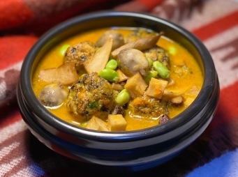

# 金湯綵球獻歲

## 📋 基本資訊 / Recipe Overview
- **料理名稱**：金湯綵球獻歲
- **份量 / Servings**：4人份
- **素食流派 / Diet**：全素 Vegan (佛教純素)
- **料理分類 / Category**：面食主食
- **來源平台 / Source**：[香港佛教聯合會 · 素食食譜](https://www.hkbuddhist.org/zh/top_page.php?p=medical_menu_detail&cid=7&type_id=2&mmid=98&id=29)
- **刊物出處**：資料來源：《香港佛教》月刊
- **功德鳴謝**：鳴謝：朱丹鳳女士

## 🌿 食材清單 / Ingredients
- 板豆腐 2塊
- 鮮香菇 50克
- 紅蘿蔔 1根
- 芹菜 3支
- 馬蹄 50克（約5-6顆）
- 黑木耳 20克
- 低筋麵粉 100克
- 生粉 30克
- 草菇 50克
- 毛豆粒 20克
- 杏鮑菇 1條

## 🧂 調味料 / Seasonings
- 胡椒粉 1茶匙
- 鮮菇粉 1茶匙
- 蔭油 1湯匙
- 芝麻油 1茶匙
- 芥花籽油 300克
- 素高湯 300克（可買現成或自行熬製）
- 鹽 1茶匙

## 🍳 烹飪步驟 / Step-by-Step Cooking Steps
1. 先製作綵球，用廚房紙吸乾板豆腐水分，然後以手搓碎豆腐備用；再將鮮香菇、半根紅蘿蔔、芹菜、馬蹄、黑木耳切碎，加進已搓碎的豆腐中，最後放入低筋麵粉、生粉、胡椒粉、鮮菇粉、蔭油、芝麻油，拌勻備用。
2. 鍋中倒入芥花籽油，八成熱後，逐個綵球放入鍋，炸至金黃酥脆，撈起備用。
3. 把另外半根紅蘿蔔磨成泥狀，備用。
4. 沖洗草菇、毛豆粒，瀝水備用。
5. 杏鮑菇切片煎香，備用。
6. 熱鑊，下少許芥花籽油，中小火炒香紅蘿蔔泥；倒入素高湯煮至微滾；再放入綵球、草菇及杏飽菇片，下鹽（若喜愛濃味，可再加入鮮菇粉、胡椒粉、芝麻油），以中小火煮至濃稠狀；最後放入毛豆粒，稍為滾開即可出鍋。

---
*食譜歸檔時間：2026-08-20 · 來源：香港佛教聯合會 (www.hkbuddhist.org)*