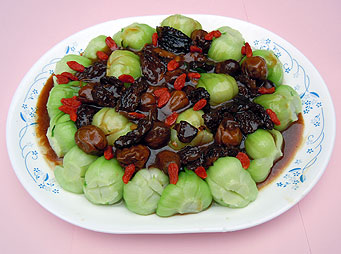

# 錦繡全珍

## 📋 基本資訊 / Recipe Overview
- **料理名稱**：錦繡全珍
- **份量 / Servings**：2-4 人份
- **素食流派 / Diet**：全素 Vegan (佛教純素)
- **料理分類 / Category**：佛門素齋 / 養生佳餚
- **來源平台 / Source**：[香港佛教聯合會 · 素食食譜](https://www.hkbuddhist.org/zh/top_page.php?p=medical_menu_detail&cid=7&type_id=2&mmid=38&id=29)
- **刊物出處**：資料來源：《香港佛教》月刊

## 🌿 食材清單 / Ingredients
- 羊肚菌
- 小棠菜
- 杞子

## 🍳 烹飪步驟 / Step-by-Step Cooking Steps
1. 羊肚菌先徹底洗淨，後燒油鑊，下薑蓉爆炒羊肚菌，再以冰糖及豉油炆煮約8分鐘至熟，盛起備用；
2. 燒一鍋熱水，下橄欖油和椒鹽，把小棠菜灼煮至熟；
3. 杞子拖水備用；
4. 把所有材料排放碟上，最後以鷹粟粉埋獻汁淋面即成。

---
*食譜歸檔時間：2026-08-20 · 來源：香港佛教聯合會 (www.hkbuddhist.org)*