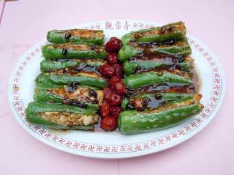

# 長青菩提

## 📋 基本資訊 / Recipe Overview
- **料理名稱**：長青菩提
- **份量 / Servings**：2-4 人份
- **素食流派 / Diet**：全素 Vegan (佛教純素)
- **料理分類 / Category**：养生汤品
- **來源平台 / Source**：[香港佛教聯合會 · 素食食譜](https://www.hkbuddhist.org/zh/top_page.php?p=medical_menu_detail&cid=7&type_id=2&mmid=41&id=29)
- **刊物出處**：資料來源：《香港佛教》月刊

## 🌿 食材清單 / Ingredients
- 青長辣椒12條
- 硬豆腐2磚
- 冬菇約8朵
- 紅棗12粒
- 醬汁：豆豉
- 豉油
- 麻油
- 鹽
- 糖
- 開水適量

## 🍳 烹飪步驟 / Step-by-Step Cooking Steps
1. 青長辣椒單面開邊，把根、核子去掉洗淨，用吸濕紙吸乾青長辣椒水分；
2. 硬豆腐壓成蓉，冬菇浸軟後切成小粒，與硬豆腐蓉攪混，並加入鹽、糖，豉油、麻油，然後下鍋快炒；
3. 青長辣椒內拍上少許生粉，並把炒好之豆腐蓉釀入青長辣椒內；
4. 釀好之青長辣椒用慢火下鍋煎熟後上碟；
5. 放油少許燒熱，用薑絲起鍋，把豆豉、豉油、麻油、鹽、糖、開水適量煮成醬汁，加入紅棗煎熟；
6. 最後將醬汁淋上煎好之青長辣椒即成。

---
*食譜歸檔時間：2026-08-20 · 來源：香港佛教聯合會 (www.hkbuddhist.org)*