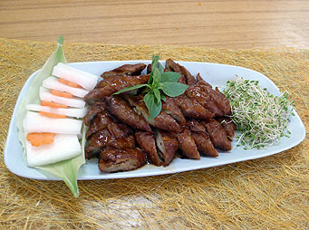

# 長養善根

## 📋 基本資訊 / Recipe Overview
- **料理名稱**：長養善根
- **份量 / Servings**：2-4 人份
- **素食流派 / Diet**：全素 Vegan (佛教純素)
- **料理分類 / Category**：养生汤品
- **來源平台 / Source**：[香港佛教聯合會 · 素食食譜](https://www.hkbuddhist.org/zh/top_page.php?p=medical_menu_detail&cid=7&type_id=2&mmid=34&id=29)
- **刊物出處**：資料來源：《香港佛教》月刊

## 🌿 食材清單 / Ingredients
- 腸根（即水筋，豆製品店可買）
- 滷水料：花椒
- 八角
- 桂皮
- 草果
- 羅漢果
- 甘草
- 薑
- 片糖
- 冰糖
- 生抽
- 老抽
- 麻油
- 粟米油
- 鹽適量

## 🍳 烹飪步驟 / Step-by-Step Cooking Steps
1. 先將所有滷水料放進鍋中加水煮約2小時，備用；
2. 腸根汆水，瀝乾水後放進滷水汁中，開火煮滾後即熄火， 讓腸根浸滷水汁過夜；
3. 翌日將腸根撈起瀝乾，落油鑊，腸根炸至皮脆即可。
4. 註：即炸即吃可保脆口，吃時可蘸以黑椒汁或咖哩汁；腸根在下油鍋炸前亦可放進冰格，可保存幾個月，吃時才炸脆。

---
*食譜歸檔時間：2026-08-20 · 來源：香港佛教聯合會 (www.hkbuddhist.org)*