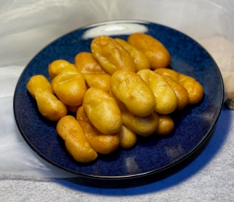

# 閩南炸棗

## 📋 基本資訊 / Recipe Overview
- **料理名稱**：閩南炸棗
- **份量 / Servings**：4人份
- **素食流派 / Diet**：全素 Vegan (佛教純素)
- **料理分類 / Category**：面食主食
- **來源平台 / Source**：[香港佛教聯合會 · 素食食譜](https://www.hkbuddhist.org/zh/top_page.php?p=medical_menu_detail&cid=7&type_id=2&mmid=109&id=29)
- **刊物出處**：資料來源：《香港佛教》月刊
- **功德鳴謝**：鳴謝：朱丹鳳女士

## 🌿 食材清單 / Ingredients
- 糯米粉 600克
- 澄粉 50克
- 紅皮番薯 500克
- 花生 200克
- 黑芝麻 50克
- 紅糖 300克
- 腰果 100克
- 芥花籽油 500克

## 🍳 烹飪步驟 / Step-by-Step Cooking Steps
1. 把紅皮番薯去皮，以滾刀式切塊，番薯放進燒開的水中煮熟（水過番薯面），撈起；趁熱放入已攪好的糯米粉、澄粉中攪拌，稍為冷卻再用手搓約10分鐘，然後加入約200克紅糖，用力攪拌20分鐘至粉糰呈光滑狀，靜置30分鐘備用。
2. 小火慢慢炒香花生至酥脆，倒出放涼，去花生皮，備用；腰果、黑芝麻慢火炒香放涼；將花生、腰果、黑芝麻用攪拌機攪至顆粒狀，再將剩餘100克紅糖加入拌勻，即成餡料，備用。
3. 將番薯糯米糰分成約20等份，每份皮用手搓成圓形並壓平，包入1湯匙餡，再掐成棗形狀，依序排開備用。
4. 鍋中倒入芥花籽油燒熱至六成油溫，依序將番薯炸棗放入鍋中，小火慢慢炸至金黃酥脆，撈起即可出鍋。

---
*食譜歸檔時間：2026-08-20 · 來源：香港佛教聯合會 (www.hkbuddhist.org)*