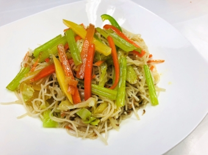

# 閩南風味 時蔬炒米粉

## 📋 基本資訊 / Recipe Overview
- **料理名稱**：閩南風味 時蔬炒米粉
- **份量 / Servings**：2 人份
- **素食流派 / Diet**：全素 Vegan (佛教純素)
- **料理分類 / Category**：面食主食
- **來源平台 / Source**：[香港佛教聯合會 · 素食食譜](https://www.hkbuddhist.org/zh/top_page.php?p=medical_menu_detail&cid=7&type_id=2&mmid=90&id=29)
- **刊物出處**：資料來源：《香港佛教》月刊
- **功德鳴謝**：鳴謝：朱丹鳳女士

## 🌿 食材清單 / Ingredients
- 椰菜 半個
- 芹菜 1把
- 紅蘿蔔 1根
- 雪菜粒 20克
- 米粉 200克
- 油 30毫升

## 🧂 調味料 / Seasonings
- 香菇粉 2茶匙
- 鹽 1茶匙
- 豉油 1茶匙
- 麻油 少許（依個人喜好而放）

## 🍳 烹飪步驟 / Step-by-Step Cooking Steps
1. 把椰菜、芹菜、紅蘿蔔洗淨，再切絲備用。
2. 把米粉用滾水浸2分鐘，然後撈起。
3. 熱鍋，倒油，油溫升至8成熱，放進所有蔬菜及雪菜粒炒1分鐘；再放入米粉拌炒；最後加進調味料，拌炒1分鐘後上碟。

---
*食譜歸檔時間：2026-08-20 · 來源：香港佛教聯合會 (www.hkbuddhist.org)*