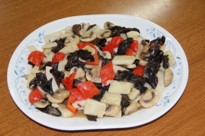

# 隨心歡喜

## 📋 基本資訊 / Recipe Overview
- **料理名稱**：隨心歡喜
- **份量 / Servings**：2-4 人份
- **素食流派 / Diet**：全素 Vegan (佛教純素)
- **料理分類 / Category**：佛門素齋 / 養生佳餚
- **來源平台 / Source**：[香港佛教聯合會 · 素食食譜](https://www.hkbuddhist.org/zh/top_page.php?p=medical_menu_detail&cid=7&type_id=2&mmid=43&id=29)
- **刊物出處**：資料來源：《香港佛教》月刊

## 🌿 食材清單 / Ingredients
- 新鮮淮山
- 新鮮蘑菇
- 雲耳（貓耳）
- 紅椒
- 新鮮椰子肉

## 🍳 烹飪步驟 / Step-by-Step Cooking Steps
1. 新鮮淮山切成小塊（可浸在鹽水中以避免變黑色），備用；
2. 鮮蘑菇切片，拖水（可以去泥味），撈起隔乾水備用；
3. 貓耳（小雲耳）浸水至軟透，拖熱水後隔乾備用；
4. 椰皇用鐵匙羮刮出裏面的椰肉，備用；
5. 紅椒切絲（或任何彩椒，隨意便可） 烹調方法： 薑茸炒香，放入貓耳和鮮淮山片，中火炒二至三分鐘，加入鮮椰肉、蘑菇，加數滴橄欖油、生抽、芥末，炒勻，最後放入紅椒絲炒勻即可，如喜歡亦可打一個淡生粉芡。

---
*食譜歸檔時間：2026-08-20 · 來源：香港佛教聯合會 (www.hkbuddhist.org)*