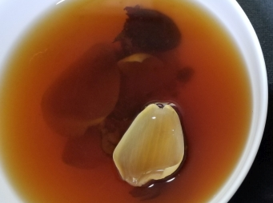

# 雅枝竹水

## 📋 基本資訊 / Recipe Overview
- **料理名稱**：雅枝竹水
- **份量 / Servings**：2-4 人份
- **素食流派 / Diet**：全素 Vegan (佛教純素)
- **料理分類 / Category**：养生汤品
- **來源平台 / Source**：[香港佛教聯合會 · 素食食譜](https://www.hkbuddhist.org/zh/top_page.php?p=medical_menu_detail&cid=7&type_id=2&mmid=86&id=29)
- **刊物出處**：資料來源：《佛聯匯訊》
- **功德鳴謝**：鳴謝：溫綺玲居士

## 🌿 食材清單 / Ingredients
- 雅枝竹 2棵
- 去核紅棗 4顆
- 水 約6杯

## 🍳 烹飪步驟 / Step-by-Step Cooking Steps
1. 雅枝竹洗淨，剪去花瓣尖最硬的地方，然後橫切約1/3 ，這樣較易出味。
2. 煲滾水後，加入雅枝竹、去核紅棗於鍋中，煲約45分鐘便可。

---
*食譜歸檔時間：2026-08-20 · 來源：香港佛教聯合會 (www.hkbuddhist.org)*