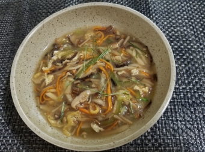

# 雜菌羹

## 📋 基本資訊 / Recipe Overview
- **料理名稱**：雜菌羹
- **份量 / Servings**：2-4 人份
- **素食流派 / Diet**：全素 Vegan (佛教純素)
- **料理分類 / Category**：养生汤品
- **來源平台 / Source**：[香港佛教聯合會 · 素食食譜](https://www.hkbuddhist.org/zh/top_page.php?p=medical_menu_detail&cid=7&type_id=2&mmid=92&id=29)
- **刊物出處**：資料來源：《佛聯匯訊》
- **功德鳴謝**：鳴謝：溫綺玲居士

## 🌿 食材清單 / Ingredients
- 海珊瑚 約30克
- 冬菇 約8朵
- 木耳 約20克
- 松茸菇 30克
- 鮮蟲草花 30克
- 勝瓜 200克
- 腐皮 1片
- 檸檬葉絲 少許
- 水 約5杯

## 🧂 調味料 / Seasonings
- 鹽 適量

## 🍳 烹飪步驟 / Step-by-Step Cooking Steps
1. 洗淨海珊瑚並浸透，放入煲內加水煲至溶化；湯水見稠滑時，撈起海珊瑚。
2. 冬菇、木耳浸軟切絲；松茸菇抹淨切絲；鮮蟲草花切小段；勝瓜去皮切絲，腐皮切絲。
3. 把所有材料放入鍋中，煲至出味；以鹽調味後，上桌前再灑上檸檬葉絲。

---
*食譜歸檔時間：2026-08-20 · 來源：香港佛教聯合會 (www.hkbuddhist.org)*