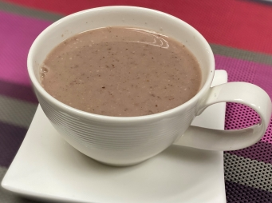

# 雜錦堅果核桃露

## 📋 基本資訊 / Recipe Overview
- **料理名稱**：雜錦堅果核桃露
- **份量 / Servings**：4 人份
- **素食流派 / Diet**：全素 Vegan (佛教純素)
- **料理分類 / Category**：养生汤品
- **來源平台 / Source**：[香港佛教聯合會 · 素食食譜](https://www.hkbuddhist.org/zh/top_page.php?p=medical_menu_detail&cid=7&type_id=2&mmid=93&id=29)
- **刊物出處**：資料來源：《香港佛教》月刊
- **功德鳴謝**：鳴謝：朱丹鳳女士

## 🌿 食材清單 / Ingredients
- 鷹嘴豆 50克
- 核桃 100克
- 花生 100克
- 乾百合 適量

## 🧂 調味料 / Seasonings
- 蔗糖適量

## 🍳 烹飪步驟 / Step-by-Step Cooking Steps
1. 把所有材料洗淨浸泡4至6小時備用。
2. 煮開1公升水，把所有材料放進鍋中，煮腍。
3. 煮腍的材料連水倒進攪拌機內，攪至綿密；然後倒進鍋中以文火熬成糊，邊煮邊攪，一直攪至滾開，最後放適量的蔗糖調勻即可享用。

---
*食譜歸檔時間：2026-08-20 · 來源：香港佛教聯合會 (www.hkbuddhist.org)*