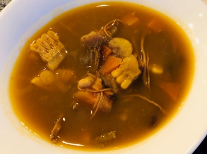

# 雪耳栗子姬松茸南瓜湯

## 📋 基本資訊 / Recipe Overview
- **料理名稱**：雪耳栗子姬松茸南瓜湯
- **份量 / Servings**：4 人份
- **素食流派 / Diet**：全素 Vegan (佛教純素)
- **料理分類 / Category**：养生汤品
- **來源平台 / Source**：[香港佛教聯合會 · 素食食譜](https://www.hkbuddhist.org/zh/top_page.php?p=medical_menu_detail&cid=7&type_id=2&mmid=82&id=29)
- **刊物出處**：資料來源：《香港佛教》月刊
- **功德鳴謝**：鳴謝：朱丹鳳女士

## 🌿 食材清單 / Ingredients
- 姬松茸 80克
- 雪耳 2朵
- 老南瓜 1個
- 紅蘿蔔 2根
- 粟米 2根
- 栗子 300克
- 椰棗 6顆

## 🧂 調味料 / Seasonings
- 油 適量
- 鹽 適量

## 🍳 烹飪步驟 / Step-by-Step Cooking Steps
1. 把姬松茸洗淨，放入溫水，浸過菇面，泡發半小時備用。
2. 浸泡雪耳，洗淨，撕成細朵。
3. 將老南瓜、紅蘿蔔、粟米、栗子洗淨；除栗子外，其他切塊備用。
4. 下少許油於鑊，將所有材料略炒備用。
5. 注入約2公升水於鍋中，放入全部材料武火煲至水滾；再改為文火煲約50分鐘；最後加入少許鹽調味即可。

---
*食譜歸檔時間：2026-08-20 · 來源：香港佛教聯合會 (www.hkbuddhist.org)*