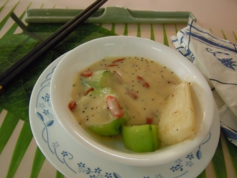

# 雲水禪風

## 📋 基本資訊 / Recipe Overview
- **料理名稱**：雲水禪風
- **份量 / Servings**：烹調方法：淮山先以中火走油，撈起。加入勝瓜一起炒3至5分鐘，加入少量鹽作調味。以半罐份量之蘑菇忌廉湯加少量水煮熱，淋在淮山和勝瓜上，再加上杞子作點綴便成。
- **素食流派 / Diet**：奶素 Lacto-Vegetarian
- **料理分類 / Category**：养生汤品
- **來源平台 / Source**：[香港佛教聯合會 · 素食食譜](https://www.hkbuddhist.org/zh/top_page.php?p=medical_menu_detail&cid=7&type_id=2&mmid=45&id=29)
- **刊物出處**：資料來源：《香港佛教》月刊

## 🌿 食材清單 / Ingredients
- 鮮淮山一枚
- 勝瓜一條
- 少量杞子
- 蘑菇忌廉湯半罐

## 🍳 烹飪步驟 / Step-by-Step Cooking Steps
1. 鮮淮山去皮，切段放入鹽水內浸備用；勝瓜去皮切成小段；杞子泡熱水一 會備用。
2. 烹調方法：淮山先以中火走油，撈起。加入勝瓜一起炒3至5分鐘，加入少量鹽作調味。以半罐份量之蘑菇忌廉湯加少量水煮熱，淋在淮山和勝瓜上，再加上杞子作點綴便成。

---
*食譜歸檔時間：2026-08-20 · 來源：香港佛教聯合會 (www.hkbuddhist.org)*