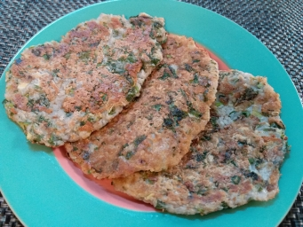

# 香煎淮山餅

## 📋 基本資訊 / Recipe Overview
- **料理名稱**：香煎淮山餅
- **份量 / Servings**：2-4 人份
- **素食流派 / Diet**：全素 Vegan (佛教純素)
- **料理分類 / Category**：面点小吃
- **來源平台 / Source**：[香港佛教聯合會 · 素食食譜](https://www.hkbuddhist.org/zh/top_page.php?p=medical_menu_detail&cid=7&type_id=2&mmid=62&id=29)
- **刊物出處**：資料來源：《佛聯匯訊》
- **功德鳴謝**：鳴謝：溫綺玲居士

## 🌿 食材清單 / Ingredients
- 日本鮮淮山300g
- 芹菜2棵
- 芫茜1棵
- 花生碎2湯匙

## 🧂 調味料 / Seasonings
- 橄欖油2湯匙
- 鹽1小匙
- 糖1小匙

## 🍳 烹飪步驟 / Step-by-Step Cooking Steps
1. 芹菜切幼粒，芫茜洗淨切碎。
2. 鮮淮山洗淨去皮，磨成茸。
3. 加入鹽、糖、芹菜粒、芫茜碎、花生碎、少許油，攪勻。
4. 熱油鑊，逐少放入淮山茸煎，細火，加蓋煎一會，反轉淮山餅，煎另一面，亦要加蓋煎，直至兩面金黃淮山熟透便成。

---
*食譜歸檔時間：2026-08-20 · 來源：香港佛教聯合會 (www.hkbuddhist.org)*