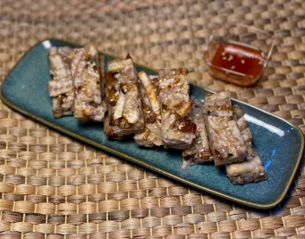

# 香煎芋頭糕

## 📋 基本資訊 / Recipe Overview
- **料理名稱**：香煎芋頭糕
- **份量 / Servings**：2人份
- **素食流派 / Diet**：全素 Vegan (佛教純素)
- **料理分類 / Category**：面食主食
- **來源平台 / Source**：[香港佛教聯合會 · 素食食譜](https://www.hkbuddhist.org/zh/top_page.php?p=medical_menu_detail&cid=7&type_id=2&mmid=110&id=29)
- **刊物出處**：資料來源：《香港佛教》月刊
- **功德鳴謝**：鳴謝：朱丹鳳女士

## 🌿 食材清單 / Ingredients
- 乾花菇 5朵
- 炸枝竹 3條
- 芋頭 300克
- 花生 50克
- 粘米粉 150克
- 澄麵粉 50克
- 飲用水 200毫升
- 即食白芝麻 20克

## 🧂 調味料 / Seasonings
- 五香粉 1小匙
- 鹽 1小匙
- 糖 1湯匙
- 胡椒粉 1小匙
- 菇粉 1小匙
- 芝麻薑油 1湯匙
- 芥花籽油 1湯匙

## 🍳 烹飪步驟 / Step-by-Step Cooking Steps
1. 把乾花菇洗淨，放入溫水浸泡，水剛浸過菇面，泡約半小時，切丁備用。
2. 將芋頭切或刨成條，加入五香粉、鹽、糖、菇粉、胡椒粉、芝麻薑油拌勻備用。
3. 炸枝竹泡開，切絲備用。
4. 熱鑊下少許油，中小火炒香花生，撈起放涼備用。
5. 將粘米粉、澄麵粉拌勻，加入約200毫升水調成粉漿備用。
6. 熱鑊下少許油，將花菇丁炒香；放入枝竹絲炒香；加入調好味的芋條，炒勻；加入花生，拌勻熄火；最後倒入調好的粉漿一起拌勻。
7. 在盤子上刷少許油防黏，放上拌好的粉漿，再放芋條，壓實壓平。
8. 鍋內煮開水，把整盆芋頭糕放入鍋內，蓋上鍋蓋，中火蒸約15分鐘至熟（視芋頭糕厚度而定時間）。
9. 拿出盤子，趁熱撒上即食白芝麻；芋頭糕放涼後，切件。
10. 把芋頭糕放平底鍋煎至兩面金黃，即可上碟。

---
*食譜歸檔時間：2026-08-20 · 來源：香港佛教聯合會 (www.hkbuddhist.org)*