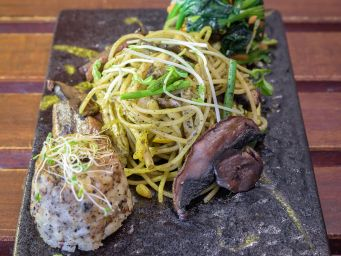

# 香草雜菌松子仁意粉

## 📋 基本資訊 / Recipe Overview
- **料理名稱**：香草雜菌松子仁意粉
- **份量 / Servings**：1人份
- **素食流派 / Diet**：全素 Vegan (佛教純素)
- **料理分類 / Category**：面食主食
- **來源平台 / Source**：[香港佛教聯合會 · 素食食譜](https://www.hkbuddhist.org/zh/top_page.php?p=medical_menu_detail&cid=7&type_id=2&mmid=54&id=29)
- **刊物出處**：資料來源：《香港佛教》月刊
- **功德鳴謝**：鳴謝：素食微調

## 🌿 食材清單 / Ingredients
- 法邊豆 3條
- 翠玉瓜 1條
- 大蘑菇 適量
- 意大利黃瓜 1條
- 幼露筍 3條
- 雜菇 適量
- 松子仁 適量
- 意大利粉 適量
- 配菜：
- 有機土豆泥 適量
- 黑松露 適量
- 時令蔬菜 適量

## 🧂 調味料 / Seasonings
- 黑胡椒 適量
- 海鹽 適量
- 自家製香草汁 1茶匙

## 🍳 烹飪步驟 / Step-by-Step Cooking Steps
1. 大蘑菇切三至四片，翠玉瓜、黃瓜、幼露筍及法邊豆等材料切好，備用。
2. 燒熱鍋，所有材料下鑊，炒至全熟。
3. 加入意粉、松子仁，意粉不用炒太久，乾身即可。
4. 加入自家製香草汁（一般超級市場購買的香草汁亦可）。
5. 加入適量的海鹽及黑胡椒，拌勻後即可盛起。
6. 將預先準備好的配菜及時令的蔬菜伴碟，即成。
7. 食譜特色：
8. 松子仁為松科植物紅松的種子仁，又名松子仁、海松子等，不僅是美味的食物，更是食療佳品，味甘性溫。具有滋陰潤肺，美容抗衰，延年益壽等功能。常用於肺燥咳嗽，慢性便秘等疾病。因而有「長壽果」、「養人寶」之稱。

---
*食譜歸檔時間：2026-08-20 · 來源：香港佛教聯合會 (www.hkbuddhist.org)*