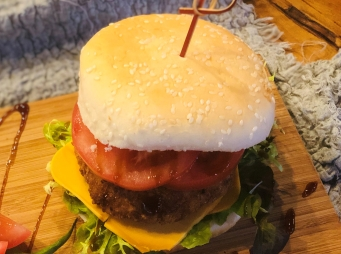

# 香酥鷹嘴豆素扒包

## 📋 基本資訊 / Recipe Overview
- **料理名稱**：香酥鷹嘴豆素扒包
- **份量 / Servings**：4 人份
- **素食流派 / Diet**：奶素 Lacto-Vegetarian
- **料理分類 / Category**：面点小吃
- **來源平台 / Source**：[香港佛教聯合會 · 素食食譜](https://www.hkbuddhist.org/zh/top_page.php?p=medical_menu_detail&cid=7&type_id=2&mmid=79&id=29)
- **刊物出處**：資料來源：《香港佛教》月刊
- **功德鳴謝**：鳴謝：朱丹鳳女士

## 🌿 食材清單 / Ingredients
- 鷹嘴豆 450克
- 三色雜菜粒（紅蘿蔔粒、青豆、玉米） 適量
- 硬豆腐 一盒
- 麵粉 少許
- 麵包糠 適量
- 沙律菜 100克
- 大番茄 1個
- 圓型漢堡包 4個
- 沙律醬 適量
- 芝士 4塊

## 🧂 調味料 / Seasonings
- 米糠油 適量
- 酵母粉 15克
- 鹽 2茶匙
- 素雞粉 2茶匙
- 即磨黑胡椒 1茶匙

## 🍳 烹飪步驟 / Step-by-Step Cooking Steps
1. 先把鷹嘴豆洗淨，浸泡4小時以上；再放入鍋中燜至鬆軟，瀝乾水分後壓碎；下少許鹽、酵母粉，最後壓成蓉備用。
2. 三色雜菜粒、沙律菜、番茄洗淨，瀝乾備用。硬豆腐切粒。
3. 下少許米糠油於鍋中，再放入豆腐粒、三色雜菜粒，並以鹽、素雞粉及即磨黑胡椒稍作調味，然後和豆蓉一起拌勻，成豆餡。
4. 取適量的豆餡做成餅狀，刷少許麵粉漿（用少量麵粉打成漿），裹上薄薄麵包糠即成素扒。
5. 倒適量的米糠油於鍋中，油溫控制在七成熱左右，逐塊素扒放入油中炸至金黃。
6. 用不粘鍋微火烘熱漢堡包，取出後在底層的麵包上加上沙律醬，再放上沙律菜、芝士、素扒、番茄，最後把面層麵包蓋上，並用竹籤固定好。

---
*食譜歸檔時間：2026-08-20 · 來源：香港佛教聯合會 (www.hkbuddhist.org)*