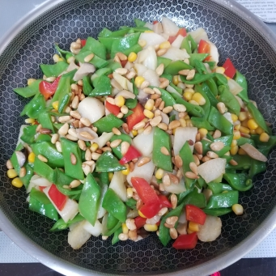

# 鮮淮山荷蘭豆松子仁

## 📋 基本資訊 / Recipe Overview
- **料理名稱**：鮮淮山荷蘭豆松子仁
- **份量 / Servings**：2-4 人份
- **素食流派 / Diet**：全素 Vegan (佛教純素)
- **料理分類 / Category**：佛門素齋 / 養生佳餚
- **來源平台 / Source**：[香港佛教聯合會 · 素食食譜](https://www.hkbuddhist.org/zh/top_page.php?p=medical_menu_detail&cid=7&type_id=2&mmid=100&id=29)
- **刊物出處**：資料來源：《佛聯匯訊》
- **功德鳴謝**：鳴謝：溫綺玲居士

## 🌿 食材清單 / Ingredients
- 鮮淮山 60克
- 荷蘭豆 40克
- 紅甜椒 1/2個
- 鮮冬菇 3朵
- 蘿蔔乾 少許
- 松子仁 1/2杯
- 薑 2片

## 🧂 調味料 / Seasonings
- 橄欖油 適量
- 鹽 適量
- 生抽 少許
- 稀有糖 少許
- 麻油 少許

## 🍳 烹飪步驟 / Step-by-Step Cooking Steps
1. 洗淨鮮淮山，去皮切粒；荷蘭豆撕去兩硬邊後斜切角；紅甜椒、鮮冬菇切粒；蘿蔔乾切幼粒。
2. 熱鑊燙松子仁，呈微黃及有香味，盛碟。
3. 熱油鑊，爆薑片，炒蘿蔔乾、鮮冬菇、荷蘭豆，灑少許水，繼續炒一會；再加入鮮淮山、紅甜椒及所有調味料，再灑少許水，冚蓋2分鐘。最後加少許麻油，炒勻盛碟。

---
*食譜歸檔時間：2026-08-20 · 來源：香港佛教聯合會 (www.hkbuddhist.org)*