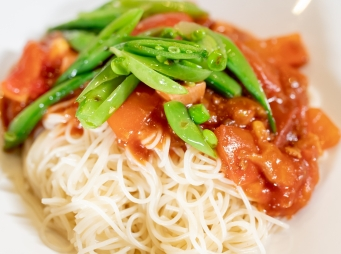

# 鮮茄甜豆天使麵

## 📋 基本資訊 / Recipe Overview
- **料理名稱**：鮮茄甜豆天使麵
- **份量 / Servings**：2 人份
- **素食流派 / Diet**：全素 Vegan (佛教純素)
- **料理分類 / Category**：面食主食
- **來源平台 / Source**：[香港佛教聯合會 · 素食食譜](https://www.hkbuddhist.org/zh/top_page.php?p=medical_menu_detail&cid=7&type_id=2&mmid=91&id=29)
- **刊物出處**：資料來源：《香港佛教》月刊
- **功德鳴謝**：鳴謝：朱丹鳳女士

## 🌿 食材清單 / Ingredients
- 鮮番茄 300克
- 甜豆 50克
- 素火腿 50克
- 天使麵 200克

## 🧂 調味料 / Seasonings
- 油 少許
- 番茄醬 2湯匙
- 素菇粉 1茶匙
- 鹽 1茶匙
- 砂糖 3茶匙

## 🍳 烹飪步驟 / Step-by-Step Cooking Steps
1. 先把鮮番茄、甜豆洗淨；甜豆切條；番茄、素火腿切丁備用。
2. 燒開水，下少許鹽，天使麵放入滾水中煮約3分鐘，撈起上碟。
3. 煮麵的同時，另鍋下少許油炒香甜豆，盛起上碟；再下素火腿粒、鮮番茄粒、番茄醬同炒；下鹽、砂糖、素菇粉抄勻，淋在天使麵上，最後放上甜豆。

---
*食譜歸檔時間：2026-08-20 · 來源：香港佛教聯合會 (www.hkbuddhist.org)*