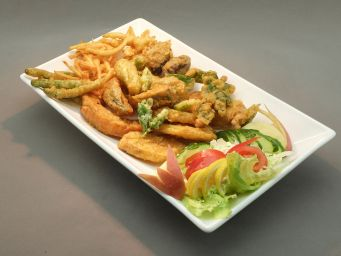

# 鮮雜菜天婦羅

## 📋 基本資訊 / Recipe Overview
- **料理名稱**：鮮雜菜天婦羅
- **份量 / Servings**：2-4 人份
- **素食流派 / Diet**：全素 Vegan (佛教純素)
- **料理分類 / Category**：面点小吃
- **來源平台 / Source**：[香港佛教聯合會 · 素食食譜](https://www.hkbuddhist.org/zh/top_page.php?p=medical_menu_detail&cid=7&type_id=2&mmid=59&id=29)
- **刊物出處**：資料來源：《香港佛教》月刊
- **功德鳴謝**：鳴謝：衍悌法師 凌雲寺

## 🔪 材料處理 / Preparation
1. 所有新鮮蔬菜（鮮冬菇除外）洗淨，切小片後徹切底風乾。
2. 鮮冬菇用乾布擦淨，在冬菇面界上十字，美觀及容易入味。
3. 瓜類如蕃薯斜切但不用太厚。牛蒡切幼條。

## 🌿 食材清單 / Ingredients
- 鮮冬菇
- 南瓜
- 四季豆
- 牛蒡
- 小青椒
- 蕃薯
- 芋頭
- 麵粉
- 鹽
- 泡打粉
- 白醋

## 🍳 烹飪步驟 / Step-by-Step Cooking Steps
1. 步驟：
2. 脆槳：先在麵粉內加入小許幼鹽及泡打粉。再加入油小許，然後加入清水（涼水）拌勻至流質狀態，不可太厚，最後加入少許白醋便成。
3. 開始炸的時候，可考慮較易熟的食材先炸。每一件蔬菜都沾上脆槳後立即放進熱油中。鮮冬菇可先下腳部。炸牛蒡的時候可一次過用幾條，沾上脆槳後下鑊，下鑊後請勿移動，直至牛蒡貼在一起。
4. 所有食材炸過一次後，可用滾油快速的再炸一次使其更鬆化。所以第一次炸的時候注意色澤不能太深。二次炸後快速起鑊即成。

## 💡 烹飪秘訣 / Chef's Tips
- 吃炸物的時候可佐以蘿蔔蓉(泥)減輕炸物的熱氣。

---
*食譜歸檔時間：2026-08-20 · 來源：香港佛教聯合會 (www.hkbuddhist.org)*