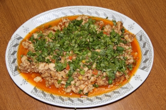

# 麻婆豆腐

## 📋 基本資訊 / Recipe Overview
- **料理名稱**：麻婆豆腐
- **份量 / Servings**：2-4 人份
- **素食流派 / Diet**：全素 Vegan (佛教純素)
- **料理分類 / Category**：佛門素齋 / 養生佳餚
- **來源平台 / Source**：[香港佛教聯合會 · 素食食譜](https://www.hkbuddhist.org/zh/top_page.php?p=medical_menu_detail&cid=7&type_id=2&mmid=44&id=29)
- **刊物出處**：資料來源：《香港佛教》月刊

## 🌿 食材清單 / Ingredients
- 豆腐
- 冬菇茸
- 芫茜茸
- 美國豆瓣醬

## 🍳 烹飪步驟 / Step-by-Step Cooking Steps
1. 豆腐三至四磚、切成小塊
2. 冬菇數朵浸透切成茸
3. 芫茜一至二棵去根切成茸 烹調方法： 薑茸炒香，加入豆腐，再加入一小粒冰糖及椒鹽（超市可買到）；另起熱鍋，加入美國豆瓣醬、冬菇茸，炒香，加入生抽；製成醬料，加到豆腐中，拌勻即可，可加入麻油、辣椒油或辣椒。

---
*食譜歸檔時間：2026-08-20 · 來源：香港佛教聯合會 (www.hkbuddhist.org)*