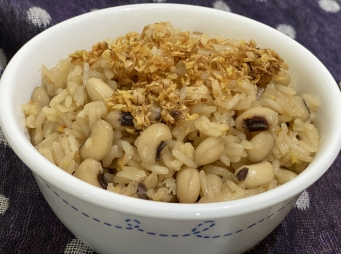

# 麻油薑眉豆飯

## 📋 基本資訊 / Recipe Overview
- **料理名稱**：麻油薑眉豆飯
- **份量 / Servings**：4 人份
- **素食流派 / Diet**：全素 Vegan (佛教純素)
- **料理分類 / Category**：面食主食
- **來源平台 / Source**：[香港佛教聯合會 · 素食食譜](https://www.hkbuddhist.org/zh/top_page.php?p=medical_menu_detail&cid=7&type_id=2&mmid=83&id=29)
- **刊物出處**：資料來源：《香港佛教》月刊
- **功德鳴謝**：鳴謝：朱丹鳳女士

## 🌿 食材清單 / Ingredients
- 泰國香米 250 克
- 眉豆 100 克
- 薑 適量

## 🧂 調味料 / Seasonings
- 芥花籽油 2 湯勺
- 麻油 1 茶匙（可依個人喜好調校份量）
- 頭抽 1 湯勺
- 鮮菇粉 1 湯匙
- 鹽 少許

## 🍳 烹飪步驟 / Step-by-Step Cooking Steps
1. 將薑切片，再剁成薑蓉備用。
2. 米洗淨，備用。
3. 眉豆洗淨，燒開熱水；將洗好的眉豆放進熱水中浸泡30分鐘，倒水，備用。
4. 燒熱油鑊，倒入芥花籽油、麻油，放進薑蓉，煮至金黃色以逼出香味。把一半份量的薑油盛起，再把洗好的 米及眉豆倒入鑊中略炒，然後加入頭抽、鮮菇粉、鹽調味。
5. 將所有炒好的材料倒入飯煲，再倒入適量的水煮成飯。
6. 將煮好的眉豆飯和盛起的薑油拌勻就可（薑油可依個人喜好的份量而加）。

---
*食譜歸檔時間：2026-08-20 · 來源：香港佛教聯合會 (www.hkbuddhist.org)*