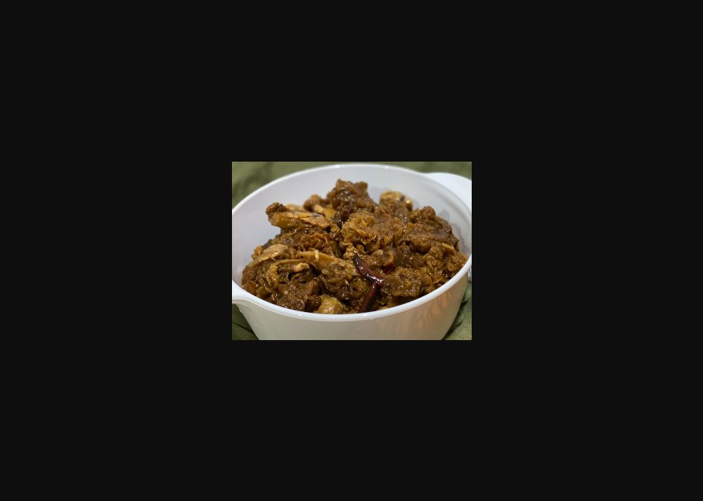

# 黃耳薑醋

## 📋 基本資訊 / Recipe Overview
- **料理名稱**：黃耳薑醋
- **份量 / Servings**：2-4 人份
- **素食流派 / Diet**：全素 Vegan (佛教純素)
- **料理分類 / Category**：养生汤品
- **來源平台 / Source**：[香港佛教聯合會 · 素食食譜](https://www.hkbuddhist.org/zh/top_page.php?p=medical_menu_detail&cid=7&type_id=2&mmid=87&id=29)
- **刊物出處**：資料來源：《香港佛教》月刊
- **功德鳴謝**：鳴謝：朱丹鳳女士

## 🌿 食材清單 / Ingredients
- 乾黃耳 100克
- 乾辣椒 5根
- 老薑 300克
- 新鮮杏鮑菇 4朵
- 芥花籽油 少許
- 水 700毫升

## 🧂 調味料 / Seasonings
- 甜醋 300毫升
- 黑醋 150毫升
- 蘋果醋 100毫升
- 黑糖 200克
- 片糖 1片
- 鹽 1茶匙
- 麻油 1/3湯匙
- 醬油 1湯匙

## 🍳 烹飪步驟 / Step-by-Step Cooking Steps
1. 建議提前一晚洗淨黃耳，浸泡後瀝乾水分備用。
2. 乾辣椒浸軟備用；清洗老薑，削皮，以刀背拍扁備用。
3. 新鮮杏鮑菇不用沖洗，用抹手紙抹乾淨就可。
4. 燒熱少許芥花籽油，煎香新鮮杏鮑菇，夾起備用。
5. 燒熱少許芥花籽油，爆香老薑，再下乾辣椒一起炒香。
6. 先把甜醋、黑醋、蘋果醋和水倒入瓷鍋內，再把老薑、辣椒放入鍋中煮開，最後放入炒好的杏鮑菇、浸好的黃耳和餘下的調味料。略攪拌一下，蓋上鍋蓋，用中小火煮約90分鐘至收汁。

---
*食譜歸檔時間：2026-08-20 · 來源：香港佛教聯合會 (www.hkbuddhist.org)*