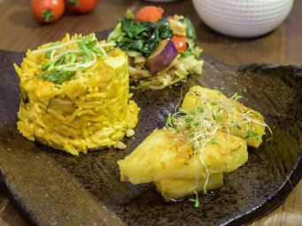

# 黃薑椰香印度素飯

## 📋 基本資訊 / Recipe Overview
- **料理名稱**：黃薑椰香印度素飯
- **份量 / Servings**：1人份
- **素食流派 / Diet**：全素 Vegan (佛教純素)
- **料理分類 / Category**：面食主食
- **來源平台 / Source**：[香港佛教聯合會 · 素食食譜](https://www.hkbuddhist.org/zh/top_page.php?p=medical_menu_detail&cid=7&type_id=2&mmid=61&id=29)
- **刊物出處**：資料來源：《香港佛教》月刊
- **功德鳴謝**：鳴謝：素食微調

## 🌿 食材清單 / Ingredients
- 意大利黃瓜1條（切數片)
- 翠玉瓜1條（適量）
- 鮮冬菇 適量
- 有機豆腐 數塊
- 菠蘿 數塊
- 印度飯 一碗

## 🧂 調味料 / Seasonings
- 黃薑粉 半茶匙
- 海鹽 適量
- 黑胡椒碎 適量
- 椰漿 1茶匙
- 熱水 適量
- 玉桂粉 適量

## 🍳 烹飪步驟 / Step-by-Step Cooking Steps
1. 鮮冬菇浸軟，翠玉瓜、黃瓜及有機豆腐切成片狀，備用。
2. 燒熱鍋，所有材料下鑊，炒至半熟。
3. 加入印度飯，期間逐少加入熱水，水份自行調節，約半碗。
4. 加入椰漿、黃薑粉，拌入印度飯及材料中，炒至飯粒黏口。
5. 加入適量的海鹽及黑胡椒，拌勻後即可盛起。
6. 菠蘿混入適量玉桂粉，可作裝飾伴碟。
7. 食譜特色：
8. 黃薑是非常有療效的食材，對身體健康有很大益處。尤其在天寒地凍的時候，來一碗黃薑椰香印度素飯更是首選。而印度飯亦極具營養，對糖尿病人也很有益。

---
*食譜歸檔時間：2026-08-20 · 來源：香港佛教聯合會 (www.hkbuddhist.org)*