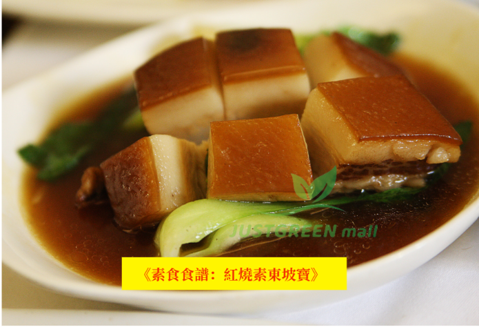

# 紅燒素東坡寶 (Braised Vegan Dongpo Pork)

## 📋 基本資訊 / Recipe Overview
- **料理名稱 (繁體)**：紅燒素東坡寶
- **料理名称 (简体)**：红烧素东坡宝
- **English Title**：Braised Vegan Dongpo Pork
- **素食流派 / Diet**：全素 Vegan
- **料理分類 / Category**：中式料理 / 精緻熱菜
- **份量 / Servings**：3-4 人份
- **準備時間 / Prep Time**：10 分鐘
- **烹飪時間 / Cook Time**：20 分鐘
- **總計耗時 / Total Time**：30 分鐘
- **來源平台 / Source**：[植境 JustGreen Mall](https://www.justgreenmall.com/blog/posts/vegan-dongpo-pork-recipe)

## 🌿 食材清單 / Ingredients
- 素東坡肉丁 300克
- 青江菜 200克
- 薑片 3片
- 八角 2個
- 桂皮 1小塊
- 冰糖 30克
- 生抽 2湯匙
- 老抽 1湯匙
- 素蠔油 1湯匙
- 麻油 1茶匙
- 水 500毫升
- 植物油 適量

## 🍳 烹飪步驟 / Step-by-Step Cooking Steps
1. 【備料】將素東坡肉丁用水輕輕沖洗，瀝乾水分；青江菜洗淨汆燙擺盤備用。
2. 【煎香】熱鑊下少量植物油，將素東坡肉丁煎至表面微黃定型出香。
3. 【爆香香料】鑊中留底油，加入薑片、八角和桂皮小火炒出濃郁香氣。
4. 【炒糖色與燜煮】加入冰糖慢火炒融，倒入生抽、老抽、素蠔油與500毫升水煮沸，放入素東坡肉丁轉小火慢燉15分鐘入味。
5. 【大火收汁】轉大火將湯汁收至濃稠紅亮，淋上少許麻油提亮，盛入鋪有青江菜的盤中即可享用。

## 💡 大廚美味秘訣 / Chef's Tips
- 素東坡肉丁以大豆植物蛋白製成，口感醇厚吸汁，青江菜可依當季喜好替換為小白菜或西蘭花。

## 📖 官方博客圖文原著詳情

紅燒東坡肉，這道充滿歷史和文化背景的經典中國菜，如今我們將它改造成為更加健康的素食版，叫做「紅燒素東坡寶」！這道菜不但保留了東坡肉傳統的濃郁味道，還以大豆蛋白製成的素東坡肉丁代替傳統的豬肉，從而減少動物脂肪的攝取，讓健康的選擇變得更加美味。今天，我們帶你走進這道素食版的東坡寶，從準備到烹調，讓你既能享受烹飪的樂趣，又能帶來味蕾的滿足感！
🛒
食材清單：
要做出這道經典的紅燒素東坡寶，食材的選擇非常關鍵。我們推薦在
JUSTGREEN mall
選購優質素東坡肉丁，這款素肉產品由天然植物蛋白製成，不僅保留了豬肉的質感與味道，還減少了脂肪的攝入，是素食者和健康飲食者的理想選擇。
-
素東坡肉丁
300
克
[
點擊購買
]
-
薑片
3
片（增加香氣）
-
八角
2
個（帶來微微的辛香風味）
-
桂皮
1
小塊（增加溫暖的香氣）
-
冰糖
30
克（為醬汁增添甜味和平衡鹹味）
-
生抽
2
湯匙（提供基礎的鹹味）
-
老抽
1
湯匙（用來上色）
-
清水
500
毫升（燉煮時的湯底）
-
青江菜
200
克（補充綠色蔬菜的營養）
🍳
烹調步驟：
1.
準備食材：將素東坡肉丁用水輕輕沖洗，然後瀝乾水分備用。這個步驟可以幫助去除產品表面的多餘雜質，讓素肉的口感更清爽自然。
🚿
2.
煎香素東坡肉丁：熱鑊下少量植物油，將素東坡肉丁煎至表面微黃。這樣處理可以讓素肉的表面形成一層薄薄的脆皮，增加口感層次。煎好後，將素肉盛起備用。
🍳
3.
炒香調料：在同一隻鑊內，加入薑片、八角和桂皮，用小火慢慢炒香。這個步驟不僅能釋放出調料的香氣，還能令整個廚房充滿暖意和期待。
🌿
4.
製作琥珀色糖醬：加入冰糖，小火煮至糖完全溶化並變成琥珀色。這步驟能賦予整道菜誘人的色澤和甜美的底味，是紅燒東坡寶的靈魂所在！
🍯
5.
加入素東坡肉丁與調味料：將素東坡肉丁放回鑊中，加入生抽和老抽，快速攪拌均勻，讓素肉均勻吸收醬汁。此時，你會聞到令人垂涎的濃郁香氣。
🥢
6.
燉煮素東坡寶：倒入清水，蓋上鍋蓋，轉中小火燜煮約
20
分鐘。這段時間內，素東坡肉丁會吸收醬汁的精華，變得更加鮮嫩入味。⏱
️
7.
煮青江菜：最後將洗淨的青江菜放入鍋內，輕輕煮
2-3
分鐘，直至青菜稍微變軟，但依然保持鮮嫩的口感。
🥬
8.
調味與收汁：在出鍋前可以調整一下味道，根據個人口味適量加糖或生抽，然後將醬汁煮至稍稍濃稠，這樣可以令每一口素東坡寶都充滿濃郁的風味。
🍲
這道紅燒素東坡寶製作完成後，色香味俱全，不僅讓你在味道上滿足，更能享受無肉版的健康滋味。
🌟
💡
小貼士與變化：
1.
食材替換：青江菜可以替換成小白菜或菠菜，根據當季食材來進行變化，能更好地享受這道菜的不同風味。
2.
健康提升：素東坡肉丁選用優質的大豆蛋白製成，口感非常接近真實的豬肉，但沒有動物脂肪，更加健康，適合素食者或減少肉類攝入的朋友。
3.
濃稠醬汁：如果喜歡醬汁更加濃稠，可以在燉煮完成後，加入少量生粉水輕輕埋芡，使湯汁更有黏稠度，這樣每一口都充滿風味。
健康的素食選擇就在你手中！
無論你是長期素食者還是剛剛開始探索素食世界，這道「紅燒素東坡寶」都會為你的素食之路帶來驚喜。使用優質素食食材，烹調出充滿傳統風味的現代健康菜餚。
JUSTGREEN mall
不僅提供多種素食產品，還有超值驚喜優惠等著你！立即登錄
JUSTGREEN mall
唯綠商城，享受新會員滿
HKD600
減
100
的超值優惠，香港地區免費送貨上門！
希望這道菜能為你的餐桌帶來更多健康與美味的選擇！
點擊這裡立即購買所需食材吧！
[JUSTGREEN mall]
- 港人首選的素食網購平臺！

---
*食譜歸檔時間：2026-08-20 · 來源：植境 JustGreen Mall (www.justgreenmall.com)*