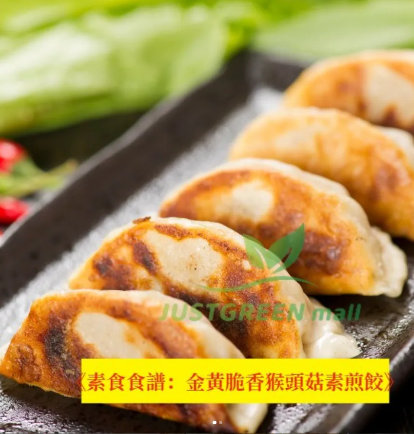

# 金黃脆香猴頭菇素煎餃 (Golden Crispy Lion's Mane Mushroom Vegan Potstickers)

## 📋 基本資訊 / Recipe Overview
- **料理名稱 (繁體)**：金黃脆香猴頭菇素煎餃
- **料理名称 (简体)**：金黄脆香猴头菇素煎饺
- **English Title**：Golden Crispy Lion's Mane Mushroom Vegan Potstickers
- **素食流派 / Diet**：全素 Vegan
- **料理分類 / Category**：點心料理 / 煎餃鍋貼
- **份量 / Servings**：4-6 人份
- **準備時間 / Prep Time**：5 分鐘
- **烹飪時間 / Cook Time**：10 分鐘
- **總計耗時 / Total Time**：15 分鐘
- **來源平台 / Source**：[植境 JustGreen Mall](https://www.justgreenmall.com/blog/posts/%E3%80%90%E7%B4%A0%E9%A3%9F%E9%A3%9F%E8%AD%9C%E3%80%91%E9%87%91%E9%BB%83%E8%84%86%E9%A6%99%E7%8C%B4%E9%A0%AD%E8%8F%87%E7%B4%A0%E7%85%8E%E9%A4%83-%E7%BE%8E%E5%91%B3%E8%A3%BD%E4%BD%9C%E6%8C%87%E5%8D%97%F0%9F%98%8D)

## 🌿 食材清單 / Ingredients
- 猴頭菇手工純素水餃 20-24個
- 植物油 2-3湯匙
- 清水 100-150毫升
- 太白粉水 1湯匙 (勾冰花薄脆)
- 經典沾醬：純釀黑醋、生抽、薑絲、辣油

## 🍳 烹飪步驟 / Step-by-Step Cooking Steps
1. 【熱鍋排餃】平底不沾鍋倒入2湯匙植物油，中火加熱均勻，將猴頭菇水餃整齊排入鍋中。
2. 【煎出脆底】中火煎約2分鐘，底部呈現微金黃色澤。
3. 【加水燜煮】倒入約100-150毫升清水（或稀薄太白粉水），立即蓋上鍋蓋，轉中小火燜煎6-8分鐘蒸熟內餡。
4. 【開蓋收脆】開蓋轉中大火，讓水分完全蒸發，煎至底部形成金黃酥脆的冰花脆皮即可起鍋。

## 💡 大廚美味秘訣 / Chef's Tips
- 純植物配方猴頭菇水餃鮮嫩多汁，煎餃時加蓋水煎能鎖住菇菌鮮香，出鍋趁熱蘸薑醋食用風味最佳。

## 📖 官方博客圖文原著詳情

1. 猴頭菇煎餃的美妙之處
1.1 猴頭菇的營養價值
猴頭菇，作為一種珍稀的食用菌類，被稱為「植物中的海鮮」，富含豐富的蛋白質、膳食纖維及多種維生素。這些營養成分不僅對人體健康有益，還能促進消化，提升免疫力。選擇猴頭菇作為煎餃的主要餡料，不僅可以讓食物更具營養價值，也增加了煎餃的口感層次。
1.2 為什麼選擇手工製作的猴頭菇煎餃？
相比市場上的冷凍水餃，自製的手工煎餃更能保留食材的鮮味和營養。JUSTGREEN mall的猴頭菇手工水餃採用純植物配方，無任何人工添加劑，口感更為鮮美且健康。這款水餃的製作過程嚴格控管，確保每一顆都能達到最佳品質。
2. 📝 精選食譜：猴頭菇素煎餃（4-6人份）
2.1 所需食材
猴頭菇手工水餃
：20-24個（根據個人喜好調整）
植物油：2湯匙（建議使用橄欖油或葡萄籽油，煎餃更香）
清水：100毫升（適量的水量讓餃子更柔軟多汁）
2.2 烹飪步驟
加熱鍋具並下油
：在不粘鍋中加入2湯匙植物油，中火加熱至油熱。
煎制猴頭菇水餃
：將猴頭菇手工水餃整齊排放於鍋中。你會聽到那陣陣「滋滋」的聲響，那是煎餃在歡快地舞動！
煎至金黃
：保持中火，煎約3-4分鐘至餃子底部呈金黃色。
加入清水蒸煮
：倒入100毫升清水，迅速蓋上鍋蓋，讓水蒸氣進一步煮熟餃子內餡，大約2-3分鐘。
收乾水分，轉大火脆化
：打開鍋蓋，讓剩餘水分自然蒸發，隨後轉大火煎至底部更加酥脆金黃。
2.3 搭配靈感
經典醋醬
：取適量醋和生抽，加入少許糖與香菜末，清新中帶有微酸的滋味，提升煎餃的口感層次。
香辣蒜蓉辣椒醬
：適合重口味愛好者，增添一抹辣意。
3. 🧑‍🍳 專家小貼士
3.1 煎餃技巧
避免頻繁翻動
：煎餃的時候要有耐心，千萬不要心急翻動，讓餃子底部自然形成脆皮，這樣才能得到完美的酥脆效果。
加入香料增香
：想要更豐富的口感？可以在煎餃完成前灑少許香草粉（如迷迭香或百里香），增加香氣層次。
享受等待的美妙
：煎餃剛出鍋時，建議等1-2分鐘讓餃子「喘一口氣」再食用，避免燙到舌頭，讓口感更為豐富。
3.2 創造屬於你的味道
煎餃搭配什麼醬料最合適？其實每個人都有自己的一套搭配秘方。你可以嘗試不同的醬料組合，甚至自製酸辣蘸醬，創造出獨特的味覺體驗！
4. 美味與家庭
想親自體驗這款
「金黃脆香猴頭菇素煎餃（點擊購買）」
的美味嗎？這道菜不僅是一道令人垂涎的美味佳餚，更是一場健康與幸福的味覺旅行。通過這道簡單卻獨特的食譜，我們希望每位讀者都能在日常生活中感受到植物性飲食的魅力。讓我們一起投入這場素食革命，為自己和家人烹製出更多健康、美味的素食料理，讓每一口都成為對生活的讚美。立即到JUST GREEN唯綠商城挑選最新鮮的食材，為你的餐桌帶來更多驚喜吧！

---
*食譜歸檔時間：2026-08-20 · 來源：植境 JustGreen Mall (www.justgreenmall.com)*