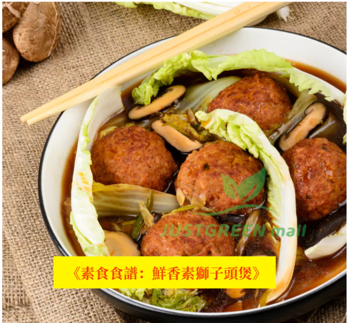

# 鮮香素獅子頭煲 (Braised Vegan Lion's Head Claypot Casserole)

## 📋 基本資訊 / Recipe Overview
- **料理名稱 (繁體)**：鮮香素獅子頭煲
- **料理名称 (简体)**：鲜香素狮子头煲
- **English Title**：Braised Vegan Lion's Head Claypot Casserole
- **素食流派 / Diet**：全素 Vegan
- **料理分類 / Category**：煲仔料理 / 經典煲湯
- **份量 / Servings**：3-4 人份
- **準備時間 / Prep Time**：10 分鐘
- **烹飪時間 / Cook Time**：15 分鐘
- **總計耗時 / Total Time**：25 分鐘
- **來源平台 / Source**：[植境 JustGreen Mall](https://www.justgreenmall.com/blog/posts/vege-soup-recipe-healthy-soy-lionhead)

## 🌿 食材清單 / Ingredients
- 紅燒素獅子頭 8個
- 新鮮生菜/結球萵苣 1棵
- 鮮冬菇 200克
- 蔬菜清湯 800毫升
- 老薑片 3片
- 植物油 2湯匙
- 素蠔油 1湯匙
- 老抽 1/2茶匙
- 白胡椒粉 1/4茶匙
- 麻油 1/2茶匙
- 生粉水 1湯匙

## 🍳 烹飪步驟 / Step-by-Step Cooking Steps
1. 【備料】生菜洗淨撕大片鋪於砂鍋底；鮮冬菇去蒂表面刻花；生薑切片備用。
2. 【爆香煎菇】熱鍋下油，中小火爆香薑片與冬菇，煎出蕈菇香氣。
3. 【砂鍋慢煨】注入800ml蔬菜清湯與素獅子頭，加入素蠔油、老抽、白胡椒粉調味，大火煮沸後轉小火煨煮10分鐘入味。
4. 【勾芡淋油】淋入薄生粉水輕推勾薄芡，滴入麻油，倒入鋪有鮮生菜的砂鍋中即可熱騰騰上桌。

## 💡 大廚美味秘訣 / Chef's Tips
- 素獅子頭飽滿扎實，吸飽冬菇清湯與素蠔油精華，底部的生菜脆甜解膩，是全家人暖心滋補的經典煲湯。

## 📖 官方博客圖文原著詳情

素食不僅僅是一種健康的飲食選擇，更是充滿創意與美味的烹飪體驗。今次我們為大家介紹一道簡單易做、充滿家庭溫馨的「鮮香素獅子頭煲」，以紅燒素獅子頭為主角，配上爽脆的生菜與鮮甜的冬菇，再用素蠔油、白胡椒粉調味，口感豐富且營養滿分！無論是工作日嘅晚餐還是週末聚餐，都能成為餐桌上的主角，讓你和家人都食得開心滿足。
🛒 食材準備
製作這道鮮香素獅子頭煲並不複雜，主要材料可以直接喺JustGreen Mall購入，方便快捷。素獅子頭口感細膩、飽滿有咬勁，特別適合做這類煲湯料理。
1.
紅燒素獅子頭
[
點擊購買
]
2.
素蠔油
[
點擊購買
]
3. 生菜、鮮冬菇、清湯等新鮮蔬菜與調味料。
JUSTGREEN mall更有新會員專屬優惠，滿HKD600減100，仲免運送貨上門，實在係素食者必備的網購平台！點擊以下連結，即可享受優惠： [
立即購買
]
🍳 鮮香素獅子頭煲製作步驟
材料清單 (3-4人份)：
- 紅燒素獅子頭 8個
- 生菜 1棵
- 鮮冬菇 200克
- 清湯 800毫升（可用蔬菜湯底代替）
- 薑片 3片
- 植物油 2湯匙
- 生粉水 1湯匙
調味料：
- 素蠔油 1湯匙
- 老抽 1/2茶匙
- 白胡椒粉 1/4茶匙
- 麻油 1/2茶匙
👩‍🍳 煮食步驟：
1. **解凍獅子頭**：先將素獅子頭解凍，為晚餐準備做預備工夫嘅時候，不如諗下今晚叫邊位朋友嚟一齊食飯？
2. **準備材料**：生菜洗淨切大塊，鮮冬菇清洗乾淨備用。
3. **爆香薑片**：熱鍋落油，加入薑片爆香，香氣四溢會令你忍唔住食指大動。
4. **煎素獅子頭**：將解凍後的素獅子頭輕輕煎至金黃，煎香的過程會增加菜餚的口感與味道層次。
5. **加入清湯與調味**：倒入清湯，加入素蠔油同老抽，湯汁開始滾起時，香氣充滿廚房。
6. **燉煮冬菇**：放入鮮冬菇慢火燉煮10分鐘，令湯底更加鮮甜。
7. **加入生菜**：最後放入生菜，煮2-3分鐘即可，生菜保持爽脆。
8. **埋芡**：加入生粉水，令湯汁濃稠有黏度，增添飽滿口感。
9. **完成！**：加入白胡椒粉和麻油，輕輕攪拌，盛碗上桌，趁熱食用，簡直係家庭聚餐嘅完美選擇！
💡 創意小貼士：
- 想豐富口感？可以加入豆腐皮或粉絲，提升整體口感層次。
- 配搭一碗香糙米飯更係無得輸，既健康又可以吸收所有美味湯汁！
- 如果喜歡味道香濃，可以加入少量五香粉作點綴。
這道菜簡單易做，香味濃郁，而且滿滿的素食營養，非常適合同家人朋友一齊享用。煮食過程充滿樂趣，無論係家庭聚會或者一個人享受，這道鮮香素獅子頭煲都會成為晚餐桌上最搶眼的美味。快啲喺JUSTGREEN mall搵齊食材，開始準備你嘅素食煲湯晚餐啦！
購物福利
立即登錄JUSTGREEN mall唯綠商城，享受新會員優惠：滿HKD600減100，免運送貨上門。別錯過機會，立即購買：https://justgreenmall.com/
JUSTGREEN mall - 你的健康素食生活夥伴！

---
*食譜歸檔時間：2026-08-20 · 來源：植境 JustGreen Mall (www.justgreenmall.com)*