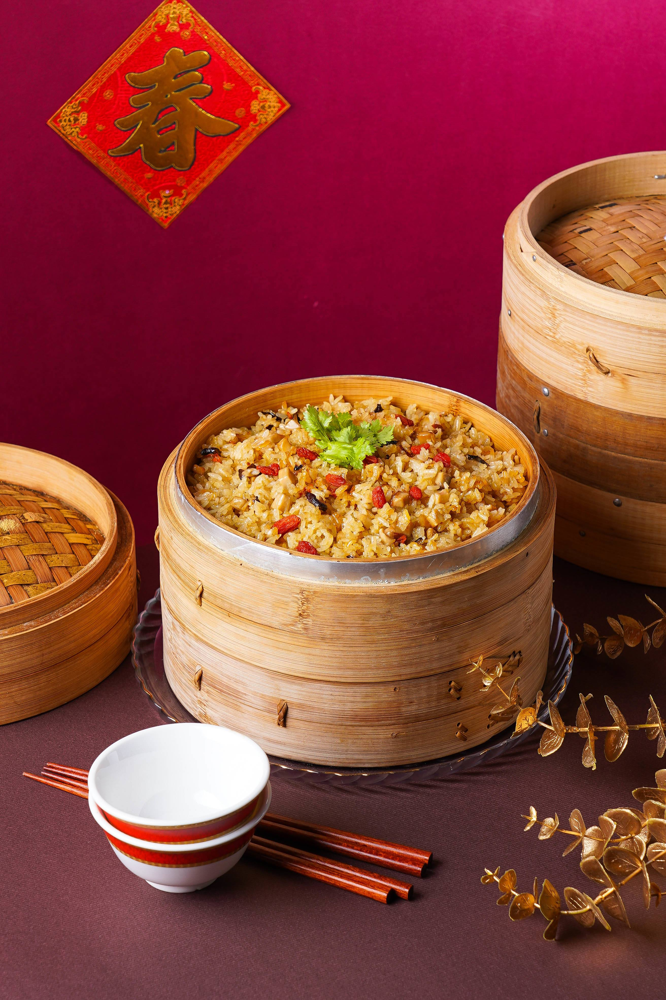

# 菇菇素米糕 (Savory Mushroom Vegetarian Sticky Rice Cake)

## 📋 基本資訊 / Recipe Overview
- **料理名稱 (繁體)**：菇菇素米糕
- **料理名称 (简体)**：菇菇素米糕
- **English Title**：Savory Mushroom Vegetarian Sticky Rice Cake
- **素食流派 / Diet**：全素 Vegan
- **料理分類 / Category**：米食 / 經典點心 / 宴席主食
- **份量 / Servings**：6-8 人份
- **準備時間 / Prep Time**：10 分鐘（浸泡約 2 小時）
- **烹飪時間 / Cook Time**：25 分鐘
- **總計耗時 / Total Time**：35 分鐘
- **來源網站 / Source**：[Knorr 康寶食譜官網](https://www.knorr.com/tw/r/%E8%8F%87%E8%8F%87%E7%B4%A0%E7%B1%B3%E7%B3%95.html/255111)

## 🌿 食材清單 / Ingredients
- 長糯米 2杯（量米杯）
- 清水 2杯（浸泡糯米及煮飯用）
- 乾香菇（泡發） 30公克
- 杏鮑菇 100公克
- 枸杞 20公克
- 老薑末 10公克
- 純黑胡麻油 2大匙
- 康寶全素鮮味炒手 3茶匙
- 白胡椒粉 1茶匙

## 🔪 刀工與前處理要求 / Prep & Knife Skills
1. **糯米浸泡**：長糯米淘洗乾淨至水清，加入 2 杯清水浸泡約 2 小時，使糯米內部澱粉充分吸水膨脹，確保蒸煮時受熱均勻、米心熟透且不夾生。
2. **菇類精細切丁**：
   - **泡發乾香菇**：擠乾水分、去除硬蒂，切成約 0.5 cm 見方的香菇小丁。
   - **杏鮑菇**：洗淨擦乾，切成與香菇丁大小一致的 0.5 cm 見方小丁。
   - **老薑**：去皮切成細薑末。
   - **枸杞**：快速沖洗乾淨，瀝乾備用。

## 🍳 烹飪步驟 / Step-by-Step Cooking Steps
1. **煸香薑菇**：熱鍋倒入 2 大匙純黑胡麻油，小火下薑末慢煸至微金黃並散發辛香；隨後下入香菇丁與杏鮑菇丁，轉中火煸炒約 2-3 分鐘至菇丁邊緣微焦香、釋放濃郁蕈菇酯香。
2. **炒米吸香**：將浸泡 2 小時的長糯米連同 2 杯浸泡水、枸杞一同倒入鍋中炒勻；加入全素鮮味炒手 3茶匙、白胡椒粉 1茶匙，中火持續翻炒 2-3 分鐘，使糯米粒均勻吸附胡麻油、鮮鹹調味與水分。
3. **入鍋蒸煮**：將炒至半乾、充分裹勻醬汁的糯米與配料整體舀出，平整放入電鍋內鍋中。
4. **定時蒸燜**：電鍋外鍋加入 1 杯水（約蒸 20-25 分鐘），按下開關開始蒸煮；待開關跳起後，**切勿立即掀蓋**，利用鍋內高溫蒸氣繼續乾燜 8-10 分鐘，讓米粒水分均衡吸收。
5. **拌鬆裝盤**：開蓋後用飯匙由鍋底向上輕柔翻拌均勻，使米糕鬆散油亮、粒粒分明，即可盛入造型碗或大盤中趁熱享用。

## 💡 料理小貼士 / Chef's Tips
- **米粒Q彈防夾生**：長糯米務必充分浸泡 2 小時；蒸好跳起後乾燜 8-10 分鐘是米糕軟糯香Q、不硬芯的關鍵秘訣。
- **胡麻油火候掌控**：煸炒薑末時務必使用小火，避免麻油在高溫下發苦；搭配白胡椒粉與菇香能營造出層次豐富的台式傳統米糕古早風味。
- **宴客擺盤**：可將米糕填入小碗壓實後倒扣在盤中，頂部點綴少許香菜或炒香的花生碎，精緻大氣。

---
*食譜歸檔時間：2026-08-20 · 收錄於 20260818-vegetarianism 本地菜譜庫*
