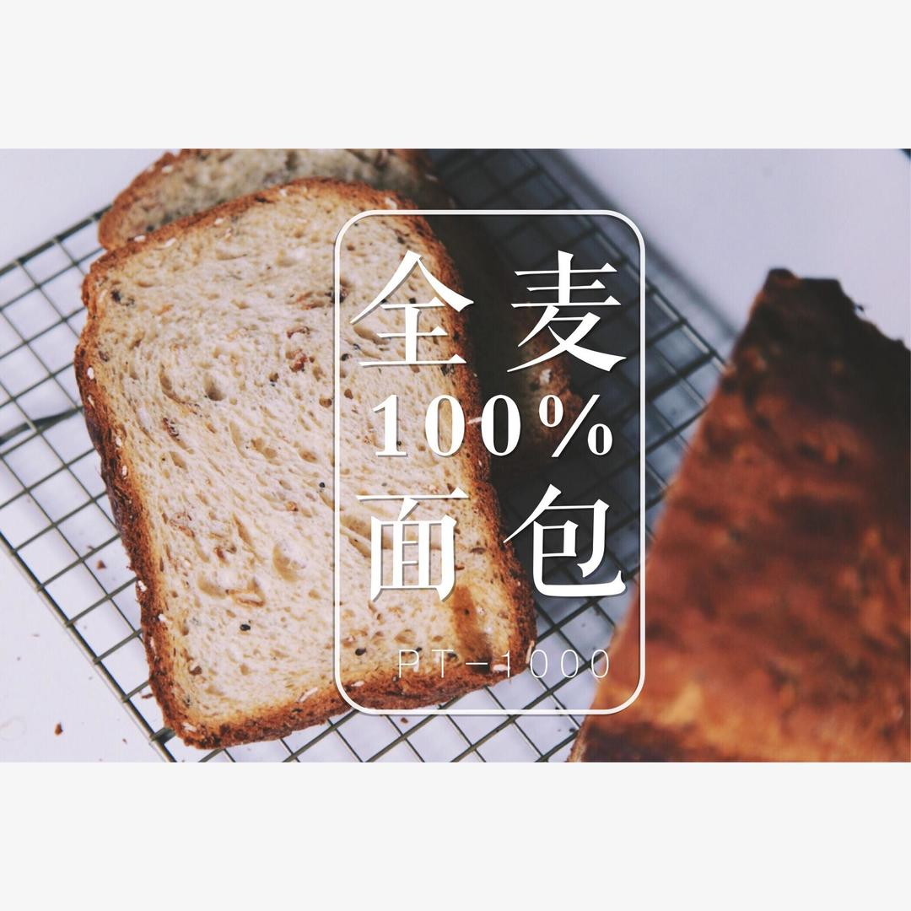

# 100%全麦面包-pt1000面包机

## 📋 基本資訊 / Recipe Overview
- **料理名稱**：100%全麦面包-pt1000面包机
- **原始標題**：100%全麦面包-pt1000面包机
- **素食流派 / Diet**：全素 Vegan
- **料理分類 / Category**：面食主食
- **來源平台 / Source**：[下廚房 · 素食主義專區](https://www.xiachufang.com/recipe/101774481/)

## 🌿 食材及佐料清單 / Ingredients
- 250g全麦粉
- 125g水
- 35g蜂蜜
- 20g橄榄油
- 2g盐
- 3g酵母
- 一大把燕麦

## 🍳 烹飪步驟 / Step-by-Step Cooking Steps
1. 燕麦放入辅料盒，酵母投入酵母盒。其余食材放进面包桶。选择普通搅拌和粗搅拌都可以。按下8号全麦面包键即可。
2. 观察面包机全麦面包模式在发酵阶段启动多次揉面程序排气，烤出来的组织和口感真的特别全麦。皮脆心韧，特别赞！全麦面包的模式不可以选择烤色，成色如图，略有些深，倒也是更有全麦的感觉了呢。
3. 切面图可见全麦的组织就是这样大孔洞的才对呢，加入了燕麦更加健康，吃起来的时候略有坚果风味。
4. 搭配减脂餐一级棒！

## 💡 大廚美味秘訣 / Chef's Tips
- 燕麦烤过半熟再做面包口味更佳～

---
*食譜歸檔時間：2026-08-20 · 來源：下廚房 (www.xiachufang.com)*