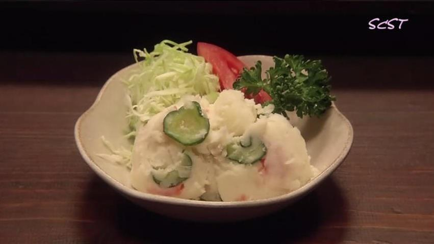

# 《深夜食堂》土豆沙拉

## 📋 基本資訊 / Recipe Overview
- **料理名稱**：《深夜食堂》土豆沙拉
- **原始標題**：《深夜食堂》土豆沙拉
- **素食流派 / Diet**：全素 Vegan
- **料理分類 / Category**：爽口凉菜
- **來源平台 / Source**：[下廚房 · 素食主義專區](https://www.xiachufang.com/recipe/1012275/)

## 🌿 食材及佐料清單 / Ingredients
- 土豆
- 黄瓜
- 西红柿
- 素食者可不加，替换成胡萝卜片之类的蔬菜即可香肠

## 🍳 烹飪步驟 / Step-by-Step Cooking Steps
1. 土豆用沸水过后，剥去外皮，碾碎
2. 趁热放入洋葱，再加入黄瓜片、西红柿丁和香肠丁
3. 要土豆冷却后，加入沙拉酱

## 💡 大廚美味秘訣 / Chef's Tips
- 所有《深夜食堂》系列的菜谱，材料、过程等都尊重原作的做法写出。 （图片也来自剧中截图~） 
 
我是素食者，自己制作时遇到非素食的菜谱会根据素食的材料和做法改动。 
不是想要复刻的多么完美，只是想给自己一个坚持做一件事的动力。 
一直很佩服有毅力去坚持做一件事的人，比如小白的每天一道菜，克叔的365道不重样早餐。 
 
2011的最后几天，开始实战深夜食堂。 
吃货的毅力养成，从做吃开始。

---
*食譜歸檔時間：2026-08-20 · 來源：下廚房 (www.xiachufang.com)*