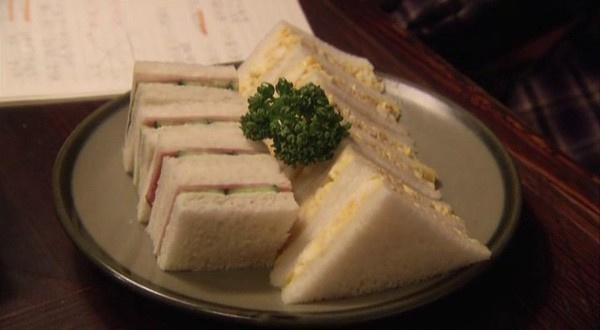

# 《深夜食堂》鸡蛋三明治

## 📋 基本資訊 / Recipe Overview
- **料理名稱**：《深夜食堂》鸡蛋三明治
- **原始標題**：《深夜食堂》鸡蛋三明治
- **素食流派 / Diet**：蛋素 Ovo-Vegetarian
- **料理分類 / Category**：爽口凉菜
- **來源平台 / Source**：[下廚房 · 素食主義專區](https://www.xiachufang.com/recipe/1013304/)

## 🌿 食材及佐料清單 / Ingredients
- 切片吐司
- 鸡蛋
- 沙拉酱
- 盐
- 胡椒

## 🍳 烹飪步驟 / Step-by-Step Cooking Steps
1. 煮熟的鸡蛋切碎，再放点沙拉酱
2. 只是因为要混合在一起，一定要搅拌均匀
3. 最后在放点盐和胡椒，和在一起
4. 夹在两层面包中间，切掉硬边，分成三角形

## 💡 大廚美味秘訣 / Chef's Tips
- 所有《深夜食堂》系列的菜谱，材料、过程等都尊重原作的做法写出。（图片来自剧中截图） 
 
我是素食者，遇到非素食的菜谱会根据素食的材料和做法改动。（会在小贴士里说明） 
不是想要复刻的多么完美，只是想给自己一个坚持做一件事的动力。 
一直很佩服有毅力去坚持做一件事的人，比如小白的每天一道菜，克叔的365道不重样早餐。 
 
2011的最后几天，开始实战深夜食堂。 
吃货的毅力养成，从做吃开始。

---
*食譜歸檔時間：2026-08-20 · 來源：下廚房 (www.xiachufang.com)*