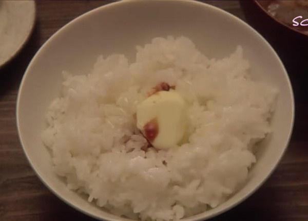

# 《深夜食堂》黄油拌饭

## 📋 基本資訊 / Recipe Overview
- **料理名稱**：《深夜食堂》黄油拌饭
- **原始標題**：《深夜食堂》黄油拌饭
- **素食流派 / Diet**：奶素 Lacto-Vegetarian
- **料理分類 / Category**：米食主食
- **來源平台 / Source**：[下廚房 · 素食主義專區](https://www.xiachufang.com/recipe/1012137/)

## 🌿 食材及佐料清單 / Ingredients
- 米饭
- （有盐、无盐皆可）黄油
- 酱油
- 黄油（有盐、无盐皆可）

## 🍳 烹飪步驟 / Step-by-Step Cooking Steps
1. 在热饭上放一小块牛油，焖30秒
2. 加上一点点酱油，拌开，即可
3. 若混合上海苔和七味唐辛子，味道更别致
4. 做法实在简单，所以对材料品质的要求就比较高。 
这是第二次做，比第一次好吃很多。 
第一次做的时候用了有盐黄油，但是黄油品质很一般，完全没有香味。这次用了蓝多湖的黄油，虽然是无盐的，但是味道真的好的多！ 
酱油用了六味鲜。也很不错。米饭是东北的有机大米。 
如果家里没有有盐黄油、日本酱油。同学们大可不必专门专门去买这两样。 
无盐黄油配合适当的其他酱油也很好味呢~ 
毕竟咱们也不天天吃黄油拌饭~

## 💡 大廚美味秘訣 / Chef's Tips
- 所有《深夜食堂》系列的菜谱，材料、过程等都尊重原作的做法写出。（图片出自剧中截图） 
 
我是素食者，遇到非素食的菜谱会根据素食的材料和做法改动。 
不是想要复刻的多么完美，只是想给自己一个坚持做一件事的动力。 
一直很佩服有毅力去坚持做一件事的人，比如小白的每天一道菜，克叔的365道不重样早餐。 
 
2011的最后几天，开始实战深夜食堂。 
吃货的毅力养成，从做吃开始。

---
*食譜歸檔時間：2026-08-20 · 來源：下廚房 (www.xiachufang.com)*