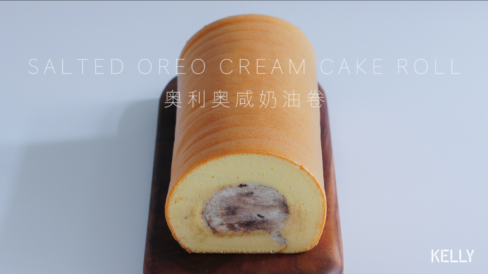

# 一口天堂超好吃的咸奶油奥利奥卷 蛋糕篇6：「厚卷」

## 📋 基本資訊 / Recipe Overview
- **料理名稱**：一口天堂超好吃的咸奶油奥利奥卷 蛋糕篇6：「厚卷」
- **原始標題**：一口天堂超好吃的咸奶油奥利奥卷/蛋糕篇6：「厚卷」
- **素食流派 / Diet**：蛋奶素 Ovo-Lacto
- **料理分類 / Category**：面点小吃
- **來源平台 / Source**：[下廚房 · 素食主義專區](https://www.xiachufang.com/recipe/102317464/)

## 🌿 食材及佐料清單 / Ingredients
- 制法见前原味蛋糕胚
- 250g淡奶油
- 15g白砂糖
- 1/4小勺盐
- 20g（饼干 4块）奥利奥碎（或去芯的奥利奥饼干）

## 🍳 烹飪步驟 / Step-by-Step Cooking Steps
1. 淡奶油加入糖和盐打发，直到成为固体，纹路清晰。
2. 加入奥利奥，打匀。
3. 保留颗粒，不要打太久
4. 卷制：
之前的视频http://www.xiachufang.com/recipe/102311306/
已经详细介绍了蛋糕卷的制作过程和卷制方法，不赘述啦~
铺上硅胶垫。
5. 放上蛋糕。
6. 斜切掉前后边缘。
7. 抹上奶油。
8. 卷起。
依旧是O型卷，之前两个视频分别介绍两种卷法，大家哪种顺手用哪种。
一鼓作气姿势帅的：http://www.xiachufang.com/recipe/102311306/
前后卷起不失败的：http://www.xiachufang.com/recipe/102315004/

（咦还挺押韵_(:зゝ∠)_）
9. 左手往前拉，右手往后推。
10. 顺势包好，放冰箱定型。
11. 取出切掉边缘。
12. 圆滚滚的奥利奥咸奶油卷就做好啦~

## 💡 大廚美味秘訣 / Chef's Tips
- 重点（敲黑板）
1.盐不要下多。
2.奥利奥不要打太碎，保留颗粒。
最最最重要的一点：
一定要冷藏之后吃，室温吃不好吃！

---
*食譜歸檔時間：2026-08-20 · 來源：下廚房 (www.xiachufang.com)*