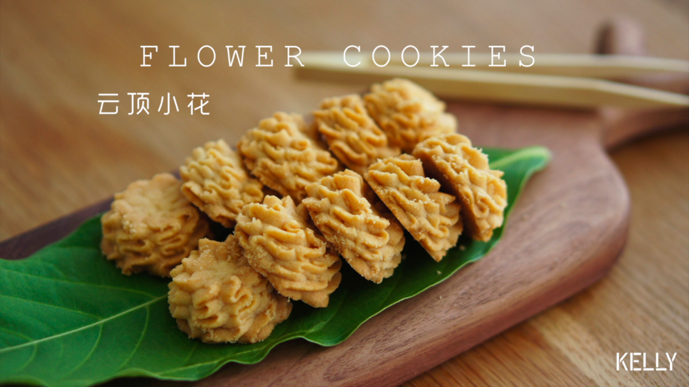

# 一抿即化酥到掉渣的珍妮曲奇云顶小花 烘焙视频饼干篇1

## 📋 基本資訊 / Recipe Overview
- **料理名稱**：一抿即化酥到掉渣的珍妮曲奇云顶小花 烘焙视频饼干篇1
- **原始標題**：一抿即化酥到掉渣的珍妮曲奇云顶小花/烘焙视频饼干篇1
- **素食流派 / Diet**：奶素 Lacto-Vegetarian
- **料理分類 / Category**：面食主食
- **來源平台 / Source**：[下廚房 · 素食主義專區](https://www.xiachufang.com/recipe/102760951/)

## 🌿 食材及佐料清單 / Ingredients
- 70g黄油
- 20g糖粉或细砂糖（糖粉最佳）
- 1g（1/4小勺）盐
- 70g低筋面粉
- 25g玉米淀粉

## 🍳 烹飪步驟 / Step-by-Step Cooking Steps
1. 准备工作：
1.烤箱预热到120℃
2.准备八齿花嘴一枚（使用三能sn7092，之前所有的蛋糕都只用这款花嘴），裱花袋一只。
3.黄油至少提早一小时取出软化备用，直到打蛋头或手指可以轻松插入。
重点！黄油一定要一定要一定要软化到位！

如果没有时间，快速软化方法如下：
1.黄油切小块，微波炉10秒取出一次观察，直到呈现半凝固状态（即依旧是固体，但有少许液体油脂）。
2.黄油切小块，拿吹风机开热风对着吹。
3.黄油切小块，拿一盆温水（不要用烫手的水）泡着，该干嘛干嘛去洗个澡回来就好了。
最好的也是最省事的做法是：前一天晚上睡前把黄油放在打蛋盆里包好室温放置，第二天早上就从里软到外了。
2. 裱花袋剪一开口
（用花嘴的尖端和裱花袋的尖头对齐，剪在花嘴的一半高度处，如有不够再补一刀。这样不会贸贸然把开口剪得太大）
3. 装入花嘴。
（尖头向下）
4. 套紧花嘴后右手握住裱花袋，左手旋转花嘴把开口收紧。
5. 取一杯子撑开裱花袋。
6. 接下来打发黄油。
完全软化的黄油可以很轻松的打发，不会有太大阻力。
7. 低速打散。
8. 加入糖和盐。
9. 加入玉米淀粉（不用过筛）
10. 用刮刀压拌。
11. 直至没有干粉。
12. 中速打发。
13. 直至颜色变浅。
14. 筛入低粉。
15. 刮刀用压拌的手法，一边旋转打蛋盆一边压拌。
16. 直至形成细腻的面糊。
17. 舀起面糊。
在杯沿处顺势刮下。
18. 把向外折的袋口翻回来，顺势转两圈把袋口拧紧。
然后把面糊向下挤到花嘴处。
19. 准备一个烤盘，铺上硅油纸或硅胶垫。
（硅胶垫会贴紧烤盘，但硅油纸最好在烤盘内滴几滴水或油固定住，不然挤花时会滑动）
20. 按照视频挤出菊花状的花纹。
厚厚的曲奇花一般需要旋转4圈左右。
21. 收口时向下轻轻压一下，放松即可断开。
22. 挤到后面会有面糊粘附在挤花袋上，左手握紧裱花袋的后部，用刮刀向前刮，将面糊聚拢到花嘴前端，不时切剁几下排出袋中的空气。
23. 这个配方不粘手，如果一开始有不满意的，可以直接拿起来塞回挤花袋里挤到满意为止_(:зゝ∠)_
挤完用拇指轻轻摁一下曲奇的表面，压平断开时产生的尖角。
24. 烘焙时间也很重要。
这款曲奇是厚而酥松的，要用低温慢烤的方式让内外酥透同时给予面糊足够的膨胀时间。
120℃，中层 45分钟。
然后转180℃，烘焙8-10分钟直至表面金黄。
取出，直接在盘子里即可，不用转移到晾架，太酥了容易碎。
25. 务必完全冷却后食用。
密封保存，室温下可保存半个月，但建议尽早食用，口感最佳。

## 💡 大廚美味秘訣 / Chef's Tips
- 下一期是珍妮曲奇和网红曲奇各自的咖啡小花配方，二者有细微的差别，大家各取所好就好~

---
*食譜歸檔時間：2026-08-20 · 來源：下廚房 (www.xiachufang.com)*