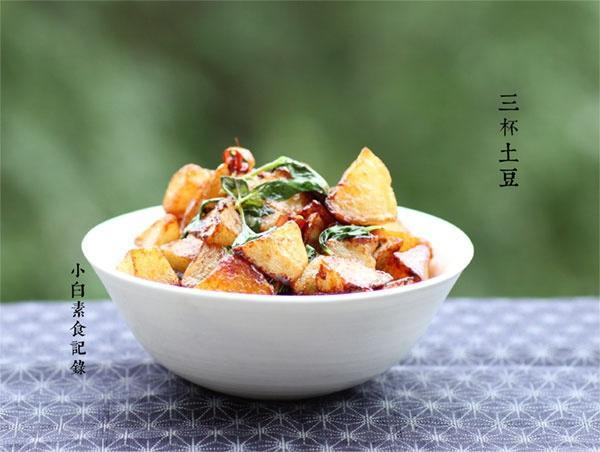

# 三杯土豆

## 📋 基本資訊 / Recipe Overview
- **料理名稱**：三杯土豆
- **原始標題**：三杯土豆
- **素食流派 / Diet**：全素 Vegan
- **料理分類 / Category**：家常蔬食 / 经典热菜
- **來源平台 / Source**：[下廚房 · 素食主義專區](https://www.xiachufang.com/recipe/1048692/)

## 🌿 食材及佐料清單 / Ingredients
- 两三个土豆
- 2大匙生抽
- 2个红辣椒
- 一块生姜
- 一大把九层塔
- 2大匙麻油（香油）
- 1小匙糖

## 🍳 烹飪步驟 / Step-by-Step Cooking Steps
1. 备料，姜一大块切片，红辣椒（干鲜皆可）切段。
2. 土豆去皮切成滚刀块，然后炸至表面金黄（自从有了空气炸锅，就不用我大热天在油锅前站着了哈哈哈，而且可以只用一点点油就有很好的效果）
3. 锅烧热，下2大匙香油，下姜片小火慢煸至姜微微发焦发干（煸姜很重要），接着下辣椒翻一下，接着下炸好的土豆，关小火加糖、生抽小火翻炒让糖融化（火大了糖很快会焦掉），调料都附在土豆上，关火。再利用余温下入九层塔拌匀即可

## 💡 大廚美味秘訣 / Chef's Tips
- 三杯里的姜要多放！不能像平时炒菜就放两片哈，怎么也放个十片 
九层塔多放也好，用余温烫软的九层塔，裹着调料好香 
最后说下香油是否高温加热的问题 
香油分为小磨香油和机榨香油 
如果你用的小磨香油，建议最后加，之前爆锅用其他油 
如果用的是机榨的就无所谓了，反正在加工过程已经高温过了。。。 
 
ps:九层塔是罗勒的一种，属亚洲罗勒，与西餐常用的甜罗勒味道不太一样哦，如没有也可用其他罗勒替代

---
*食譜歸檔時間：2026-08-20 · 來源：下廚房 (www.xiachufang.com)*