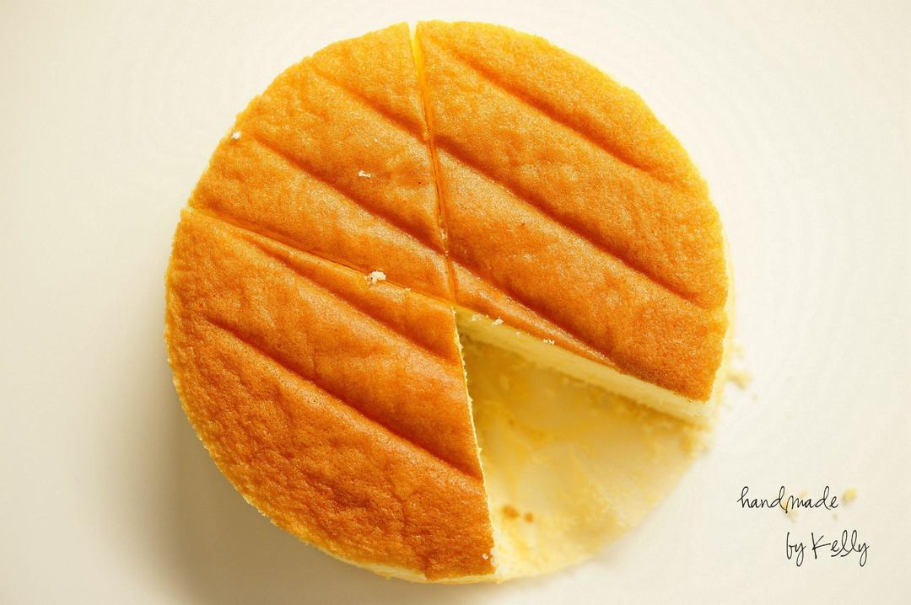

# 不易失败的 日式海绵｜视频及gif

## 📋 基本資訊 / Recipe Overview
- **料理名稱**：不易失败的 日式海绵｜视频及gif
- **原始標題**：（不易失败的）日式海绵｜视频及gif
- **素食流派 / Diet**：蛋奶素 Ovo-Lacto
- **料理分類 / Category**：面食主食
- **來源平台 / Source**：[下廚房 · 素食主義專區](https://www.xiachufang.com/recipe/100495129/)

## 🌿 食材及佐料清單 / Ingredients
- （18cm圆模一个量）
- 150g（3个）全蛋
- 110g砂糖
- 6g(称量后可转换为1又1/2小勺）水饴
- 100g低筋粉
- 26g黄油
- 40g牛奶

## 🍳 烹飪步驟 / Step-by-Step Cooking Steps
1. 160℃ 30-35分钟 至表面金褐色。
分离蛋清及蛋黄 
预热烤箱（建议高10-20度）
2. 蛋清分3次加入砂糖 搅打至湿性发泡。
3. 每次一颗加入蛋黄 搅打均匀。
4. 筛入低粉 捞拌。
（我是用蛋抽 也可以用刮刀~）
5. 如图搅拌至粘稠顺滑后 加入融化的黄油+水饴+牛奶。
6. 继续捞拌。因为密度差距大 一开始不易混合 只要坚持捞拌下去 就会形成蓬松流畅的蛋糕糊。
7. 直至形成如图所示可流畅滑落的蛋糊 需要多搅拌1分钟左右 具体状态请看视频。
8. 入模。
9. 磕出大气泡 放入预热好的烤箱 中下层 160℃ 30-35分钟 至表面金褐色。
10. 出炉 在10厘米左右向桌上砸一下蛋糕模震出热气 倒扣在冷却架上 脱模 倒扣5-6分钟左右翻转正面向上晾凉。
11. 一般建议打发奶油及涂抹果子露食用。
果子露做法：
细砂糖 27g
水 80g
利口酒 20g

做法很简单：水+细砂糖煮沸 冷却后加入利口酒涂抹在蛋糕体上即可。

18cm圆模抹面奶油在380g左右。

## 💡 大廚美味秘訣 / Chef's Tips
- 依旧是视频 现在都把一切能裁掉的裁掉 快进的快进 在开头有状态时间目录 大家看看有没有用
视频地址：http://v.qq.com/page/j/c/n/j01540t5dcn.html
http://static.video.qq.com/TPout.swf?vid=j01540t5dcn&auto=0

---
*食譜歸檔時間：2026-08-20 · 來源：下廚房 (www.xiachufang.com)*