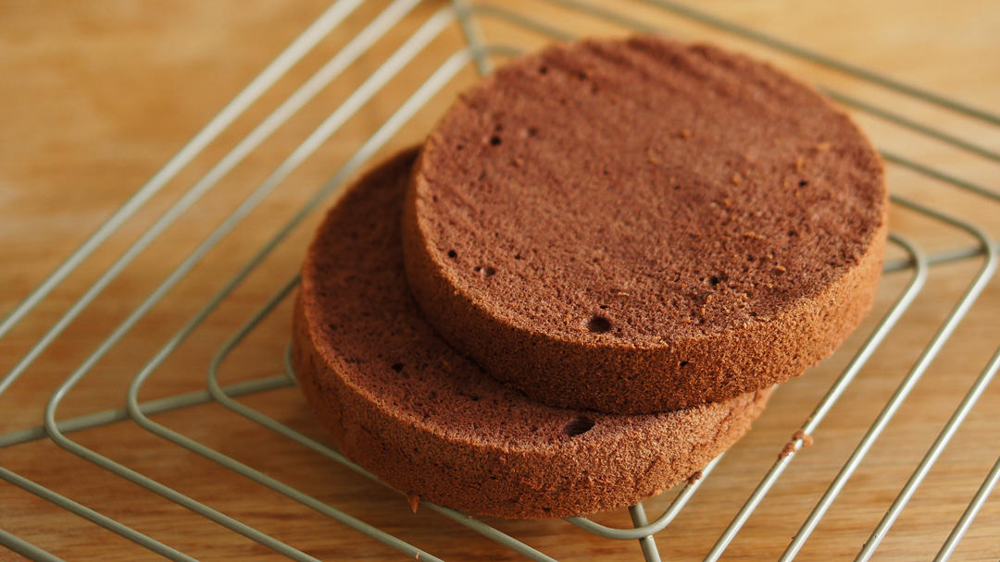

# 不消泡的巧克力戚风胚 「戚风及其衍生」烘焙视频蛋糕篇2

## 📋 基本資訊 / Recipe Overview
- **料理名稱**：不消泡的巧克力戚风胚 「戚风及其衍生」烘焙视频蛋糕篇2
- **原始標題**：不消泡的巧克力戚风胚/「戚风及其衍生」烘焙视频蛋糕篇2
- **素食流派 / Diet**：蛋奶素 Ovo-Lacto
- **料理分類 / Category**：面食主食
- **來源平台 / Source**：[下廚房 · 素食主義專區](https://www.xiachufang.com/recipe/102257709/)

## 🌿 食材及佐料清單 / Ingredients
- 3个鸡蛋
- 55克低筋面粉
- 15克可可粉
- 60克白砂糖
- 37g植物油
- 60克牛奶

## 🍳 烹飪步驟 / Step-by-Step Cooking Steps
1. 中小火加热植物油15到20秒，不要烧太久。
表面有涟漪出现就关火。
2. 冲入可可粉中搅拌均匀。
3. 加入牛奶，搅拌均匀，静置晾凉。
（一、使用冷藏的牛奶可以加快冷却速度。
二、如果像我一样用比较厚的锅加热油脂，记得是把油倒粉里而不是把粉筛油里，要不后面等待冷却会等到你哭。）
4. 在等待液体晾凉的时候我们来分鸡蛋。
5. 摸一下装有可可粉的打蛋盆，降温到和手心温度相近就可以了，不要着急，太烫加入面粉会造成糊化。
筛入低粉。
6. 搅拌成粘稠的面糊。
7. 加入蛋黄，搅拌均匀。
8. 应该是光滑，流畅如飘带一般的。如果太稠，看看是不是没晾凉操作了。
9. 接下来打发蛋清。分三次下糖。
10. 一开始蛋清的体积不大，可以倾斜打蛋盆聚拢蛋清加速打发。
11. 打出白色气泡下1/3的糖。
12. 气泡变细密下第二次。
13. 出现纹路下最后的糖。
14. 打发至干性发泡。
因为可可粉有弱化蛋糕结构的性质，如果（像我一样）用圆模，最好打至干性发泡加强支撑性。
这个配方用中空模来做也很合适，打发到湿性发泡就可以了。
15. 低速缓提甩掉蛋白霜。
16. 舀一刮刀蛋白霜和蛋黄糊拌匀。
17. 倒回剩余的蛋白霜中。
18. 混合均匀。
19. 从视频中可以看到，面糊细腻柔顺，没有消泡的情况。
20. 形成蓬松流畅的面糊，痕迹不会消失掉。
21. 入模。
22. 震出大气泡。
23. 145℃ 60-65分钟。
倒扣晾凉剖片，不赘述，操作手法可以看「草莓奶油蛋糕」

## 💡 大廚美味秘訣 / Chef's Tips
- 为下一期巧克力奶油蛋糕做准备。
——（这货是我用来收买未来婆婆的终极配方「想的真远︿(￣︶￣)︿」

巧克力奶油完美的平衡程度，香醇而入口即化，浓而不苦，香而不腻，既没有市售蛋糕只加入可可粉的淡薄，也不是美式巧克力蛋糕的浓烈和刺激。
夏天快要到了，来吃冰冰凉的巧克力奶油蛋糕吧~
烘焙愉快：）

---
*食譜歸檔時間：2026-08-20 · 來源：下廚房 (www.xiachufang.com)*