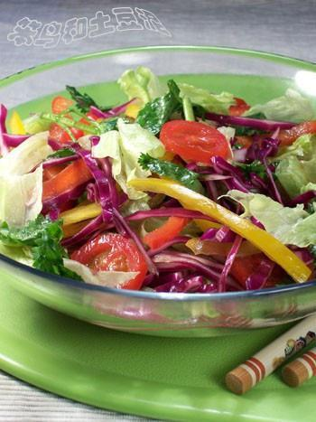

# 五彩有机大拌菜

## 📋 基本資訊 / Recipe Overview
- **料理名稱**：五彩有机大拌菜
- **原始標題**：五彩有机大拌菜
- **素食流派 / Diet**：全素 Vegan
- **料理分類 / Category**：家常蔬食 / 经典热菜
- **來源平台 / Source**：[下廚房 · 素食主義專區](https://www.xiachufang.com/recipe/15223/)

## 🌿 食材及佐料清單 / Ingredients
- 球生菜
- 紫甘蓝
- 小番茄
- 红椒
- 黄椒
- 香菜
- 盐
- 醋
- 香油

## 🍳 烹飪步驟 / Step-by-Step Cooking Steps
1. 紫甘蓝、红椒、黄椒洗净切成丝；生菜撕成小块；小番茄横切成圆片；香菜切成段；红、黄、紫、浅绿、深绿，刚好五种颜色
2. 用适量盐、醋、香油做成调味汁，拌在一起即可。事实证明，这个搭配拌出来的菜味道很好，可谓色、香、味俱全

## 💡 大廚美味秘訣 / Chef's Tips
- 以下资料来源于网络 
有机食品、绿色食品、无公害食品 
 
一、安全食品新概念 
1、无公害食品 
指产地生态环境清洁，按照特定的技术操作规程生产，将有害物含量控制在规定标准内，并由授权部门审定批准，允许使用无公害标志的食品。无公害食品注重产品的安全质量，其标准要求不是很高，涉及的内容也不是很多，适合我国当前的农业生产发展水平和国内消费者的需求，对于多数生产者来说，达到这一要求不是很难。当代农产品生产需要由普通农产品发展到无公害农产品，再发展至绿色食品或有机食品，绿色食品跨接在无公害食品和有机食品之间，无公害食品是绿色食品发展的初级阶段，有机食品是质量更高的绿色食品。 
2、绿色食品 
绿色食品概念是我们国家提出的，指遵循可持续发展原则，按照特定生产方式生产，经专门机构认证，许可使用绿色食品标志的无污染的安全、优质、营养类食品。由于与环境保护有关的事物国际上通常都冠之以“绿色”，为了更加突出这类食品出自良好生态环境，因此定名为绿色食品。 
无污染、安全、优质、营养是绿色食品的特征。无污染是指在绿色食品生产、加工过程中，通过严密监测、控制，防范农药残留、放射性物质、重金属、有害细菌等对食品生产各个环节的污染，以确保绿色食品产品的洁净。 
为适应我国国内消费者的需求及当前我国农业生产发展水平与国际市场竞争，从1996年开始，在申报审批过程中将绿色食品区分AA级和A级。 
A级绿色食品系指在生态环境质量符合规定标准的产地，生产过程中允许限量使用限定的化学合成物质，按特定的操作规程生产、加工，产品质量及包装经检测、检验符合特定标准，并经专门机构认定，许可使用A级绿色食品标志的产品。 
AA级绿色食品系指在环境质量符合规定标准的产地，生产过程中不使用任何有害化学合成物质，按特定的操作规程生产、加工，产品质量及包装经检测、检验符合特定标准，并经专门机构认定，许可使用AA级有绿色食品标志的产品。AA级绿色食品标准已经达到甚至超过国际有机农业运动联盟的有机食品的基本要求。 
3、有机食品 
有机食品是国际上普遍认同的叫法，这一名词是从英法Organic 
Food直译过来的，在其他语言中也有叫生态或生物食品的。这里所说的“有机”不是化学上的概念。国际有机农业运动联合会（IFOAM）给有机食品下的定义是：根据有机食品种植标准和生产加工技术规范而生产的、经过有机食品颁证组织认证并颁发证书的一切食品和农产品。国家环保局有机食品发展中心（OFDC）认证标准中有机食品的定义是：来自于有机农业生产体系，根据有机认证标准生产、加工、并经独立的有机食品认证机构认证的农产品及其加工品等。包括粮食、蔬菜、水果、奶制品、禽畜产品、蜂蜜、水产品、调料等。 
有机食品与无公害食品和绿色食品的最显著差别是，前者在其生产和加工过程中绝对禁止使用农药、化肥、除草剂、合成色素、激素等人工合成物质，后者则允许有限制地使用这些物质。因此，有机食品的生产要比其他食品难得多，需要建立全新的生产体系，采用相应的替代技术。 
4、绿色无公害食品 
绿色无公害食品是出自洁净生态环境、生产方式与环境保护有关、有害物含量控制在一定范围之内、经过专门机构认证的一类无污染的、安全食品的泛称，它包括无公害食品、绿色食品和有机食品。 
在绿色无公害食品认识上要注意如下几个问题： 
（1）绿色无公害食品未必都是绿颜色的，绿颜色的食品也未必是绿色无公害食品，绿色是指与环境保护有关的事物，如绿色和平组织、绿色壁垒、绿色冰箱等。 
（2）无污染是一个相对的概念，食品中所含物质是否有害也是相对的，要有一个量的概念，只有某种物质达到一定的量才会有害，才会对食品造成污染，只要有害物含量控制在标准规定的范围之内就有可能成为绿色无公害食品。 
（3）并不是只有偏远的、无污染的地区才能从事绿色无公害食品生产，在大城市郊区，只要环境中的污染物不超过标准规定的范围，也能够进行绿色无公害食品生产，从减轻农用化学物质污染的作用分析，在发达地区更有重要的环保意义。 
（4）并不是封闭、落后、偏远的山区及没受人类活动污染的地区等地方生产出来的食品就一定是绿色无公害食品，有时候这些地区的大气、土壤或河流中含有天然的有害物。 
（5）野生的、天然的食品，如野菜、野果等也不能算作真正的绿色无公害食品，有时这些野生食品或者它们的生存环境中含有过量的污染物，是不是绿色无公害食品还要经过专

---
*食譜歸檔時間：2026-08-20 · 來源：下廚房 (www.xiachufang.com)*