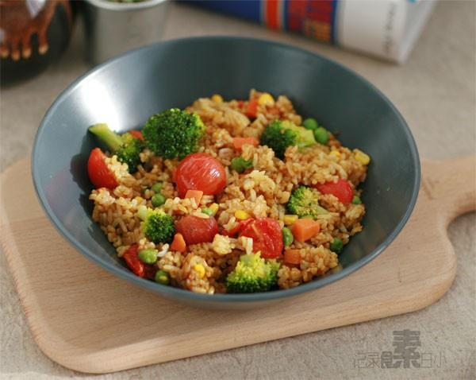

# 什蔬咖喱炒饭

## 📋 基本資訊 / Recipe Overview
- **料理名稱**：什蔬咖喱炒饭
- **原始標題**：什蔬咖喱炒饭
- **素食流派 / Diet**：全素 Vegan
- **料理分類 / Category**：面食主食
- **來源平台 / Source**：[下廚房 · 素食主義專區](https://www.xiachufang.com/recipe/1000657/)

## 🌿 食材及佐料清單 / Ingredients
- 米饭
- 西兰花
- 胡萝卜
- 玉米
- 青豆
- 圣女果
- （或普通咖喱粉，咖喱块）自制咖喱粉
- 盐

## 🍳 烹飪步驟 / Step-by-Step Cooking Steps
1. 西兰花与胡萝卜丁，青豆玉米粒一起用水焯过待用。圣女果从中间切开
2. 锅里倒油烧热，加咖喱粉小火炒香，然后加入圣女果翻炒
3. 锅中加入米饭炒匀，最后加焯熟的西兰花，胡萝卜丁，青豆玉米炒匀，加盐调味即可

## 💡 大廚美味秘訣 / Chef's Tips
- 炒饭也有多种多样的做法~菜饭一起包括，很适合一个人吃，或者带便当 
 
自制咖喱粉请看我的菜谱~

---
*食譜歸檔時間：2026-08-20 · 來源：下廚房 (www.xiachufang.com)*