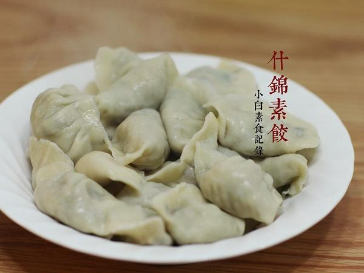

# 什锦素饺子

## 📋 基本資訊 / Recipe Overview
- **料理名稱**：什锦素饺子
- **原始標題**：什锦素饺子
- **素食流派 / Diet**：全素 Vegan
- **料理分類 / Category**：面食主食
- **來源平台 / Source**：[下廚房 · 素食主義專區](https://www.xiachufang.com/recipe/1081082/)

## 🌿 食材及佐料清單 / Ingredients
- 面粉
- 常温水
- 五六棵塌菜
- 十个左右香菇
- 一小捆粉丝
- 半块老豆腐
- 半根胡萝卜
- 1小匙盐
- 1大匙生抽
- 半小匙糖
- 一点点姜末
- 一点点白胡椒粉

## 🍳 烹飪步驟 / Step-by-Step Cooking Steps
1. 这些蔬菜做的馅儿量是满满一汤盆。塌菜洗净切碎，加1小匙盐拌匀静置十分钟，挤掉大部分水分待用。香菇去蒂切碎，胡萝卜切碎碎，锅烧热下少许油将胡萝卜香菇下锅炒香待用。老豆腐切小丁，放入油锅中炸至微微发黄，注意不要炸太干，那样口感会太硬（本来想用香干的，忘了买于是炸了豆腐替代）粉丝用热水烫软，切1厘米的段待用。把这些料和调料统统拌在一起，如果不够润可适量加点油。
2. 在面粉中加入常温水，建议边加水边搅拌，观察湿润程度，饺子皮的面和的偏硬一点这样吃起来劲道好吃，把面和成团，做到三光“盆光手光面团光”盖上盖子醒一会。（通常500G面粉加280G水和出的软硬合适，但是具体要看面粉吸水量还有空气潮湿等而定） 
把面团弄成粗条，就成小块（剂子），撒上面粉揉滚一下，让剂子变成球状，用手压扁。用擀面杖擀成中间偏厚边缘薄的饺子皮，与面板接触的那面要多蘸些面粉防粘，与擀面杖接触的这部分要少蘸面粉，防止包饺子的时候不好捏合。 
然后取适量馅放皮上，按照自己习惯的方式封口捏合~原则就是在保证饺子不露馅的情况下尽量多包点馅~
3. 煮饺子，烧开一大锅水，用手将饺子放入锅中，不要一下子都倒进去哈~用勺子搅动一下防粘，通常煮荤饺子水开三开，素饺子开两开就足矣（就是下入饺子后水开了然后加半碗凉水然后再开再加） 
另外我妈教了一个用高压锅煮饺子的方法，肯定不会煮破，高压锅烧开水后下饺子，盖上锅盖，不上阀，待冒气后关火，闷2分钟即可
4. 饺子皮没用完咋办，我家习惯包俩糖饺子，糖和面粉3:2的比例拌匀，作为馅包入即可，注意馅料量一定要少，菜饺子的1/3足够。红糖白糖皆可，这次用的是桂花糖。面粉的加入是防止糖融化后流汤~
5. 我爱的川味红油汁，1份的量：2大匙生抽，1大匙陈醋，半大匙辣椒油，1/2小匙糖

## 💡 大廚美味秘訣 / Chef's Tips
- 北方过年吃饺子，难免有童鞋不太熟悉过程，或者不知道怎么弄素馅，这是除夕夜包饺子时拍的，感谢老妈做手模~ 
吃腻了蘸酱油醋？另附我超爱的红油汁调法 
饺子皮没用完？包几个糖饺子吧~往后看

---
*食譜歸檔時間：2026-08-20 · 來源：下廚房 (www.xiachufang.com)*