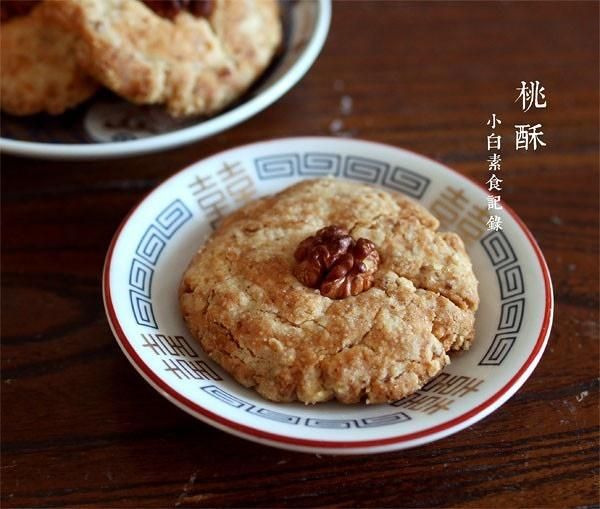

# 传统桃酥

## 📋 基本資訊 / Recipe Overview
- **料理名稱**：传统桃酥
- **原始標題**：传统桃酥
- **素食流派 / Diet**：全素 Vegan
- **料理分類 / Category**：面食主食
- **來源平台 / Source**：[下廚房 · 素食主義專區](https://www.xiachufang.com/recipe/1011693/)

## 🌿 食材及佐料清單 / Ingredients
- 30g熟核桃仁
- 100g普通面粉
- 30g白糖
- 1/4小匙泡打粉
- 1/8小匙苏打粉
- 40g玉米油
- 15毫升水

## 🍳 烹飪步驟 / Step-by-Step Cooking Steps
1. 先将熟核桃仁捣碎待用
2. 想粉质的面粉、糖、泡打粉和苏打粉过筛到容器中，加上核桃仁拌匀
3. 加入油和水先拌成粗粒状，然后揉成团，分成四等分
4. 每份团成球，再用手压成1cm厚的饼，中间镶嵌上一块核桃仁
5. 平铺在烤盘上，入预热好的烤箱170度 中层烤25分钟--30分钟表面上色即可

## 💡 大廚美味秘訣 / Chef's Tips
- 热乎的时候可能不酥，晾凉冷却后会就特别酥~ 
烘焙用油以无异味为佳，也可用葵花籽油

---
*食譜歸檔時間：2026-08-20 · 來源：下廚房 (www.xiachufang.com)*