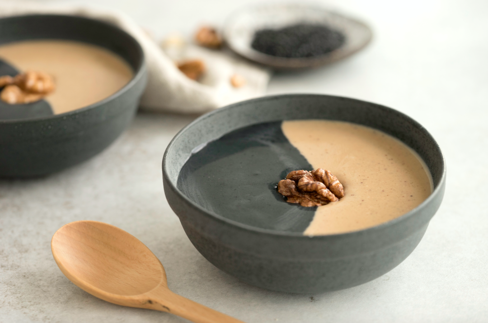

# 做碗糖水铺一样香滑的芝麻糊，其实不难

## 📋 基本資訊 / Recipe Overview
- **料理名稱**：做碗糖水铺一样香滑的芝麻糊，其实不难
- **原始標題**：做碗糖水铺一样香滑的芝麻糊，其实不难
- **素食流派 / Diet**：全素 Vegan
- **料理分類 / Category**：米食主食
- **來源平台 / Source**：[下廚房 · 素食主義專區](https://www.xiachufang.com/recipe/102806170/)

## 🌿 食材及佐料清單 / Ingredients
- *黑芝麻糊*
- 180克黑芝麻
- 100克糯米
- 800毫升水
- 适量枫糖浆
- *红枣核桃糊*
- 160克核桃
- 40克红枣
- 100克糯米
- 800毫升水
- 适量枫糖浆

## 🍳 烹飪步驟 / Step-by-Step Cooking Steps
1. ＊黑芝麻糊做法＊

糯米放在碗里用水泡2个小时。

▼碎碎念▼
用糯米做的芝麻糊比白米做的更柔滑，所以还是建议不要把糯米改成其他米类。至于糯米粉，也是可以的，不过要小心用避免起粉块。反正也要磨芝麻，为何不把糯米一起磨，要用外面不知道有没有加其他东西的糯米粉呢，对吧？
2. 中大火热锅，等手放在离锅五只手指的高度也能感受到一股热气攻上掌心时，下黑芝麻快速翻炒30秒到1分钟。

▼碎碎念▼
炒时勤翻芝麻，防止在锅底的芝麻受热过度而烤焦。一定要快速炒！如果炒久了芝麻会变苦！
3. 把糯米，水和炒过芝麻放在搅拌机中打，直至芝麻和糯米打碎没有明显米粒。

▼碎碎念▼
好的搅拌机马达够强，2-3分钟就可以全打碎。
4. 把过滤筛放在煮锅上面，倒进芝麻浆，把残渣过滤掉。然后重复这个步骤再过滤一次。

▼碎碎念▼
如果想做出来的芝麻糊又滑又顺，就不能偷懒只过滤一次。如果浆在筛中卡住，可以用勺子搅拌并压一下，使浆继续往下流。
5. 开中大火，按自己喜欢的甜度加入枫糖浆(或其他糖类), 将浆煮至沸腾后转中小火，用大汤勺不断搅拌，会发现浆慢慢变稠到糊状时(颜色也会逐渐变深)即可。
6. ＊ 红枣核桃糊做法＊

糯米泡水备用。大火快炒核桃让香气出来。
7. 糯米，水，红枣和核桃放搅拌机中打至没明显颗粒。把打好的浆倒进过滤筛隔开残渣。

▼碎碎念▼
因为核桃的残渣比较细，建议多过滤几次(起码三次以上)，这样出来的核桃糊更滑。
8. 开中大火，按自己喜欢的甜度加入枫糖浆(或其他糖类), 将浆煮至沸腾后转中小火，用大汤勺不断搅拌，让浆慢慢变稠到糊状时即可。
9. 或者你也可以做芝麻糊拼核桃糊：

把芝麻糊和核桃糊分别装在两个不同容器里，分开放在靠碗的左右边，同时往碗里倒。

如果芝麻糊(或核桃糊)倒得比较快，占据碗的一半以上，可以先把芝麻糊(或核桃糊)的一边暂停，另一边继续倒，直至两糊各占一半，就会出现这样漂亮的拼糊。
10. 最后放半颗核桃作装饰。
11. 秋天吃碗糊糊，感觉特别暖心，特别滋润。分开吃，混着吃，都一样好吃。
12. 想看更快的更新，记住要我的关注公众号plantcept哦❤️

## 💡 大廚美味秘訣 / Chef's Tips
- 广式传统糖水铺的芝麻糊是我来英国后最怀恋的食物之一。

没办法，在西方人民只能接受糊糊是咸的(也就是它们的西式汤)这个大环境下，糖水铺很难受欢迎，大多数的中餐馆甜品也只能选罐头荔枝还是炸香蕉。

曾经试过外面买来的黑芝麻糊冲剂，试了以后想说还是算了吧。口感差，香气不足，像是吃了假的芝麻糊。

不过自从自己在家试做了黑芝麻糊之后，就再也不用到外面找好吃的芝麻糊了。

---
*食譜歸檔時間：2026-08-20 · 來源：下廚房 (www.xiachufang.com)*