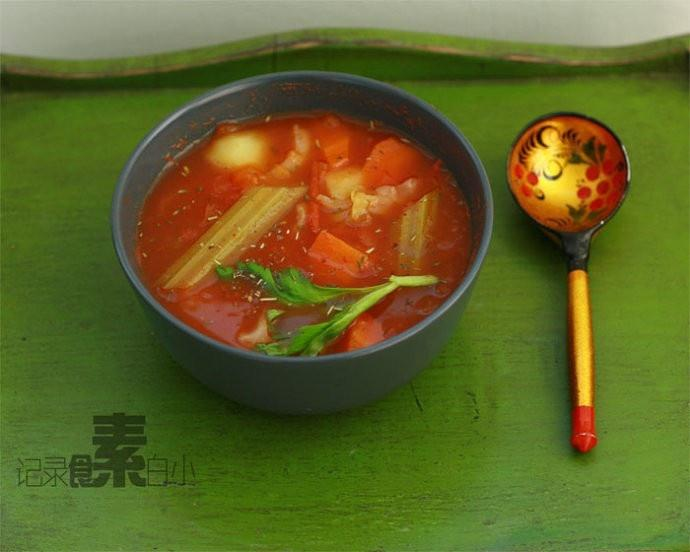

# 全素罗宋汤

## 📋 基本資訊 / Recipe Overview
- **料理名稱**：全素罗宋汤
- **原始標題**：全素罗宋汤
- **素食流派 / Diet**：全素 Vegan
- **料理分類 / Category**：面食主食
- **來源平台 / Source**：[下廚房 · 素食主義專區](https://www.xiachufang.com/recipe/36115/)

## 🌿 食材及佐料清單 / Ingredients
- 土豆
- 胡萝卜
- 西红柿
- 圆白菜
- 西芹
- 番茄沙司
- 盐
- 黑胡椒粉
- 综合香草

## 🍳 烹飪步驟 / Step-by-Step Cooking Steps
1. 将西红柿，胡萝卜，土豆切滚刀块
2. 手撕几片圆白菜
3. 西芹切成段
4. 烧开一锅水，将切好的胡萝卜，土豆，西红柿放入，水开后改小火慢慢将西红柿煮烂，胡萝卜土豆煮软
5. 然后将西芹，圆白菜放入一起煮片刻
6. 加番茄沙司（依口味，如果想让汤浓可多加西红柿和番茄沙司），盐，黑胡椒粉，综合香草碎

## 💡 大廚美味秘訣 / Chef's Tips
- 看了下综合香草的配料，我买的是带研磨器的，有加碘海盐，迷迭香，百里香，红椒碎，粉红胡椒，香薄荷，罗勒，龙蒿。如果家里没有综合香草可不加，一样美味。

---
*食譜歸檔時間：2026-08-20 · 來源：下廚房 (www.xiachufang.com)*