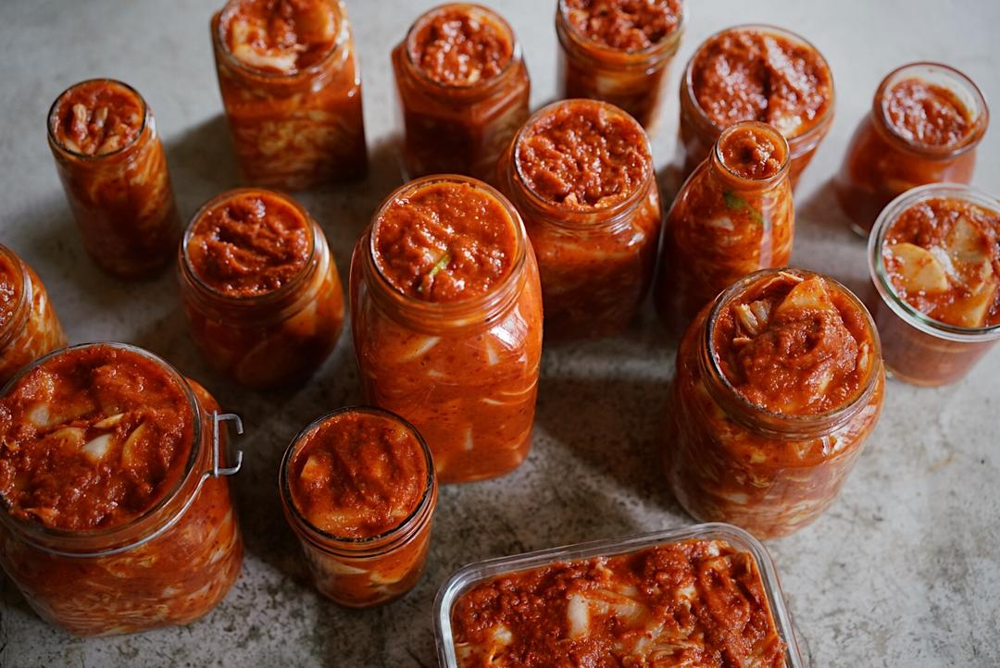

# 全老师家的辣白菜 韩国的一种家庭做法

## 📋 基本資訊 / Recipe Overview
- **料理名稱**：全老师家的辣白菜 韩国的一种家庭做法
- **原始標題**：全老师家的辣白菜（韩国的一种家庭做法）
- **素食流派 / Diet**：全素 Vegan
- **料理分類 / Category**：面食主食
- **來源平台 / Source**：[下廚房 · 素食主義專區](https://www.xiachufang.com/recipe/104214101/)

## 🌿 食材及佐料清單 / Ingredients
- 一大棵（2千克左右）大白菜
- 60g盐
- 水
- #洋葱大蒜生姜水果糊
- 1个（中等大小）苹果
- 一个（中等大小）梨
- 一个（中等大小）洋葱
- 半头大蒜
- 一块（大概4cm）生姜
- 30g雪碧(可选）
- #糯米粉糊糊
- 25g糯米粉
- 150g冷水
- #其它
- 125g韩式泡菜辣椒粉（粗粒）
- 一把小葱
- 半根-1根白萝卜（可选）
- 根据口味添加可能需要的额外的盐

## 🍳 烹飪步驟 / Step-by-Step Cooking Steps
1. 首先，大家需要知道，这个辣白菜需要两天来完成制作。第一天，用盐水泡辣白菜，第二天后续操作。我们先来看一看原料吧。
图片是新鲜食材部分，这颗大白菜净重4斤呢，请不要用娃娃菜，太小了口感不脆。
另外需要提前购买的有糯米粉，最普通的那种就好，可以超市里买一点散装的，用量不大。
韩式辣椒粉可能需要提前网购，我用的是“小伙子”粗粒辣椒粉，泡菜专用，一包500g，15.5包邮。请大家自行安排。韩国辣椒粉红而不辣，如果你特别特别不能吃辣，请酌情减少辣椒粉用量。
2. 第一天：用盐水泡辣白菜。
把白菜叶一片一片掰下来洗净，然后横切成2.5cm宽的条，如图。我觉得这个宽度最适合，长度就白菜叶本身的长度就好，如果有最外面的特别大的叶子，那就中间来一刀，让它短一点。
3. 都切好了，找一个大盆或者大锅，一层白菜，撒薄薄的一层盐，再一层白菜一层盐，这4斤白菜我总共用了60g的盐。
然后往盆里加水，我就加的自来水，有讲究的加过滤水也行，加到还有2cmji就要没过白菜，也就是水面比白菜低2cm，因为之后白菜还会出水，如果不留出空间，你的整个台面会遭殃~也请大家注意，水别放太多，我们需要的是，白菜腌渍出水后，整体的水量刚刚没过最上层的白菜就好，水过多盐水会淡，导致有个别同学的白菜腌了一天还是很脆！
压一个锅盖在白菜上，为了不让白菜漂在水面上，静置大概24个小时，差不多就行
4. 大概24个小时过去了，我们拿起一块白菜，弯一弯，捏一捏，这种程度就可以了，不会捏断，就说明它具有一定的柔韧性，水出的差不多了。
5. 大概把水挤一挤，不要太湿哒哒，之后我们会给白菜添加其它的水份
6. 把洋葱大蒜去皮，苹果梨生姜都洗干净去掉核，不用去皮，都切成小块，放在榨汁机里面打成泥，不好打的话，加一点雪碧帮忙，不用太多，30g的样子。这个糊糊里水果和雪碧都提供了甜味
7. 打好的糊糊这样子，不需要特别特别细，稍有颗粒没关系
8. 把辣椒粉放到葱蒜水果糊糊里，混合均匀
9. 煮糯米糊
糯米粉+冷水放在小锅中，混合均匀，一定要用冷水把糯米粉调开。
10. 开小火，边煮边搅拌，有点耐心，不一会儿，就变成这个样子啦，半透明很黏稠的糊糊，关火。煮的过程别偷懒，要搅拌！
11. 把煮熟的糯米糊放到辣椒葱蒜糊糊里
12. 混合均匀，诱人的红色出来啦~一会儿我们就用这个混合物来拌白菜
13. 倒入处理好的白菜中，拌呀拌，这个时候你会发现韩国人喜欢用的那种食品级橡胶手套是最好用的，不过用筷子也行，就是有点累手。
14. 拌好的白菜是不是有点辣白菜的样子啦。别着急，把那把小葱洗干净，切成3-4cm的段，也放进去拌匀。
15. 然后再切半根白萝卜，切成这样，也放进去拌匀。体会一下辣白菜里的萝卜嘛，是彩蛋！
可以观察一下整盆辣白菜有没有多余的糊糊，如果有，白萝卜可以再多放一点。然后尝一尝整体味道，如果你喜欢把辣白菜当咸菜吃，那就加盐。我喜欢当配菜吃，一点都不咸的，爽口的最好，所以在这一步我是基本上不加盐的。
16. 都拌好啦，这个时候可以尝一口，“生泡菜”酸味没出来，味道和发酵好的不一样呢，
17. 装瓶！
瓶子一定要刷干净，晾干，不要有水有油。
这瓶给那个邻居，那瓶给另外那个邻居嗯嗯，图片上这些是两大棵大白菜做的，如果用配方中的量，那就是图片中一半的样子。
留一两瓶室温发酵一两天，然后开吃。其余的直接冰箱冷藏，慢慢发酵，冷藏放两个月不成问题。
18. 接下来用辣白菜做各种好吃的
石锅拌饭
19. 辣白菜炒饭
20. 辣白菜炒饭+1
还可以做泡菜饼、泡菜豆腐汤。
其实单独吃辣白菜就很好吃啦！

## 💡 大廚美味秘訣 / Chef's Tips
- 东北大白菜刚下来的时候，北京还没进入冬季，我跟全老师的老丈人，用微信图文视频同步的方式学习了韩国辣白菜的家庭做法。全老师是位韩国友人，高尔夫球教练，我不认识他，也不认识他老丈人，全老师的太太是我的朋友，本来想把这个写进聊个天做个菜里的，由于一些无常的原因，我们这次先只学他们家菜谱，聊天看看以后有没有机会。
 第一次吃到这个辣白菜是去年冬天了，跟全老师的太太见面，她装了一瓶带给我，正巧当时家里有超市买的那种辣白菜，一对比，差异就出来了，家庭版的味道干净、纯粹，市售版的就多了很多多余的味道，从那以后，我就不买外面的辣白菜了。
 这个辣白菜是正宗的韩国做法，与常见的，半棵白菜整个腌的方法不一样，据全老师说，因为家庭很少有那种腌整棵大白菜的大坛子，所以这种先切再腌的方式更适合现代家庭，味道也丝毫不打折扣。直接装成一瓶一瓶的，送朋友，或者冷藏起来吃一瓶拿一瓶，方便得狠。
 
成份说明：有的辣白菜里放虾酱之类的，这个配方没有，我在第一次尝到这个辣白菜之前特意问过，是素食的，原因居然是全老师对虾过敏哈哈哈。但是这个配方里有葱蒜以及洋葱，如果有忌口的童鞋请注意，不放葱蒜洋葱也可以做辣白菜，但是味道差异会挺大，不吃五辛的童鞋可以参考这个配方http://www.xiachufang.com/recipe/1011972/
辣白菜是冬季之友，可以直接吃，可以做泡菜汤，可以做泡菜炒饭，说得我有点流口水了，我参考了一部分姜食堂版本做的泡菜炒饭，老好吃了。

再就是，你知道自己腌的辣白菜是有灵魂的吗？辣白菜是发酵食物，这个版本的辣白菜刚刚拌匀腌起来就可以马上吃，叫做“生泡菜”，接下来你可以室温放置1-2天，室温越高，放置时间越久，它发酵产生的酸味越浓，如果赶上室温温度高，比如25度以上，那可能会导致发酵过于迅猛，泡菜水伴随着发酵产生的气体，顺着瓶子口溢出来，，或者干脆我们直接把它放在冰箱冷藏，延缓发酵是速度，延长它的寿命，这类似烤面包发酵面团的低温发酵法，用时间来换取更柔和和高级的味道。
刚刚拌好的生泡菜，常温放置一天的微发酵味道，两天的味道
冷藏发酵两周的味道~都不一样
随着时间的推移，口感也不一样，最开始的脆脆的，时间久了会慢慢柔软入味，这些都会影响之后用它做的菜肴的口味。
没尝试过动手做辣白菜的童鞋，试一试吧，把每天刷手机的时间挤出来一点，感受下它的变化过程，用它亲手烹饪菜肴，喜悦的享用它。

---
*食譜歸檔時間：2026-08-20 · 來源：下廚房 (www.xiachufang.com)*