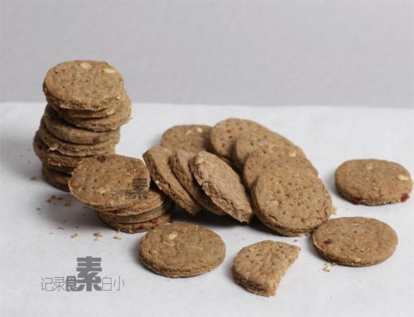

# 全麦消化饼

## 📋 基本資訊 / Recipe Overview
- **料理名稱**：全麦消化饼
- **原始標題**：全麦消化饼
- **素食流派 / Diet**：全素 Vegan
- **料理分類 / Category**：面食主食
- **來源平台 / Source**：[下廚房 · 素食主義專區](https://www.xiachufang.com/recipe/1005562/)

## 🌿 食材及佐料清單 / Ingredients
- 140g全麦粉
- 60g植物油
- 3大匙红糖
- 1/2小匙盐
- 1/2小匙小苏打
- 2大匙水
- 1大匙（可略）燕麦片

## 🍳 烹飪步驟 / Step-by-Step Cooking Steps
1. 把全麦粉、红糖、小苏打、盐都筛到大碗中，搅拌均匀
2. 加入植物油搅拌均匀，再加入水和燕麦片团成面团
3. 将面团擀成0.5cm厚的饼，用模子印成喜欢的形状 再将剩余的面揉团，擀成饼，再用模子重复直到面团全部用完
4. 饼干胚放到烤盘上，用叉子随意叉上透气孔，到饼干的1/2厚度即可
5. 烤箱预热5分钟，将饼干放入烤箱 190度20分钟即可

## 💡 大廚美味秘訣 / Chef's Tips
- 冷却后食用，饼干是酥酥的，密封保存不要受潮，1周内食用 
 团面团的时候会有点散，用手将面团握在一起即可 
移到烤盘上的时候要轻柔小心 
 我用的是黑麦全麦粉，所以颜色发黑，普通全麦粉做出来的颜色跟市面上出售的消化饼干颜色基本一致。

---
*食譜歸檔時間：2026-08-20 · 來源：下廚房 (www.xiachufang.com)*