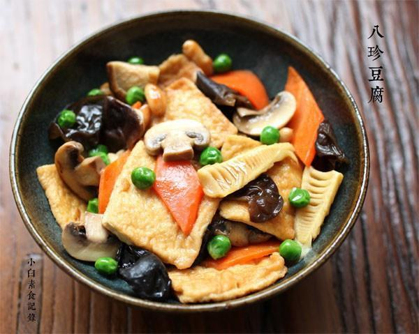

# 八珍豆腐

## 📋 基本資訊 / Recipe Overview
- **料理名稱**：八珍豆腐
- **原始標題**：八珍豆腐
- **素食流派 / Diet**：全素 Vegan
- **料理分類 / Category**：面食主食
- **來源平台 / Source**：[下廚房 · 素食主義專區](https://www.xiachufang.com/recipe/1040791/)

## 🌿 食材及佐料清單 / Ingredients
- 一块老豆腐
- 一根春笋
- 半根胡萝卜
- 一小把青豆
- 两三个口蘑
- 两朵香菇
- 少许花生
- 少许木耳
- 两片姜
- 1/2小匙盐
- 2小匙生抽
- 2块冰糖
- 一点点白胡椒粉

## 🍳 烹飪步驟 / Step-by-Step Cooking Steps
1. 老豆腐切成4厘米大小0.5厘米厚的方片（大概就行），如果水分多，最好用厨房纸巾吸下水。平底不粘锅烧热，多下点油，把豆腐摆入小火煎至一面金黄，然后翻面煎另一面，盛出待用。
2. 春笋去壳切段，胡萝卜切片，香菇口蘑切块，速冻青豆解冻，黑木耳泡发
3. 锅烧热下少许油，下生姜煸香，下花生胡萝卜翻炒，接着下香菇口蘑木耳春笋同炒至9成熟，下入煎过的豆腐还有解冻好的青豆翻炒一下。
4. 加入一碗水到锅中，加盐、生抽、冰糖、白胡椒粉调味，小火继续加热，让豆腐吸饱汤汁然后大火收一下汁即可出锅。

## 💡 大廚美味秘訣 / Chef's Tips
- 八珍，加上豆腐将就家里的食材凑了八样，当然可灵活变化，建议最好放两种菌菇类的提鲜，再放点色彩鲜亮的提色。 
煎豆腐时最好用不粘锅，否则容易糊锅，另外一定要在锅旁看着火哦~别跑去干别的！

---
*食譜歸檔時間：2026-08-20 · 來源：下廚房 (www.xiachufang.com)*