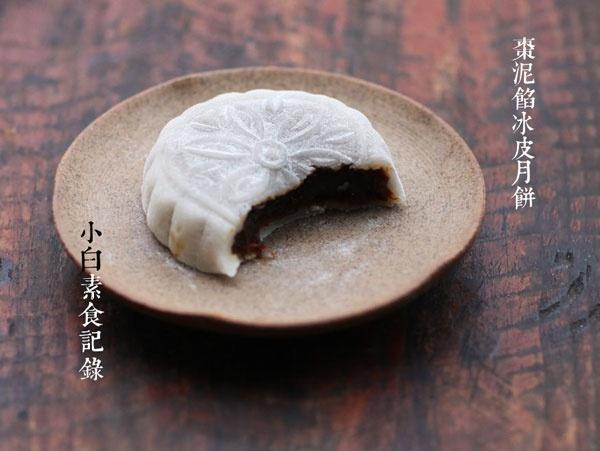

# 冰皮枣泥馅月饼

## 📋 基本資訊 / Recipe Overview
- **料理名稱**：冰皮枣泥馅月饼
- **原始標題**：冰皮枣泥馅月饼
- **素食流派 / Diet**：全素 Vegan
- **料理分類 / Category**：面食主食
- **來源平台 / Source**：[下廚房 · 素食主義專區](https://www.xiachufang.com/recipe/1060211/)

## 🌿 食材及佐料清單 / Ingredients
- 冰皮：
- 100g糯米粉
- 60g澄粉
- 80g粘米粉
- 60g白糖
- 350g水
- 馅料：
- 500g红枣
- 30g面粉
- 20g玉米油
- 炒熟糯米粉20g（防粘裹表面用）糕粉：

## 🍳 烹飪步驟 / Step-by-Step Cooking Steps
1. 大枣洗净用水浸泡一会，放入烧开水的蒸锅中，盖严锅盖大火蒸半小时，晾凉后耐心的剥皮去核，（这真的是一个非常需要耐心的活儿）将枣肉捣烂。（建议用捣的，如果用搅拌机会打不动）锅烧热下入枣泥翻炒，然后20g油（玉米油或葵花籽油）分次加入炒匀，最后加入面粉30G炒匀即可。晾凉后就是枣泥馅，分成30g大小每份，用手搓成球待用
2. 将冰皮中的所有材料混合均匀，连容器放入烧开水的蒸锅中大火蒸15分钟，蒸透搅拌均匀顺滑。（如果发现有没蒸透的地方就搅拌好，适当延长时间，通常，用浅平的容器会蒸的时间短又均匀） 
放冷后分成35G没份的大小待用（冰皮非常粘手，一定要用保鲜膜垫在手中）
3. 糕粉的准备，把糯米粉放入锅中，小火慢炒至颜色微微有点黄，香味出来了即可，不要炒过头啊~
4. 包：取一份冰皮，隔保鲜膜压扁，放上一份枣泥馅，向上包裹严，冰皮的延展性非常好
5. 隔保鲜膜拧成球状，放入糕粉中滚一圈防粘，（注意要均匀的裹上，否则会黏住月饼模子）然后放入月饼模中压扁，脱模即可

## 💡 大廚美味秘訣 / Chef's Tips
- 冰皮我准备了两种口味，一半蒸好的冰皮加了5g抹茶粉，另一半加了5g的椰粉，大家可随意发挥想象力啊 
冰皮容易变硬，如果操作时间较长最好盖上保鲜膜防干 
冰皮月饼做好后如果不马上吃，最好放入密封的保鲜盒入冰箱冷藏保存，可保持3天

---
*食譜歸檔時間：2026-08-20 · 來源：下廚房 (www.xiachufang.com)*