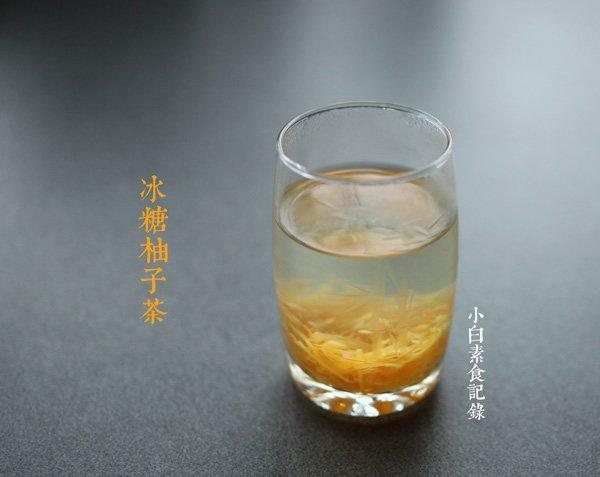

# 冰糖柚子茶

## 📋 基本資訊 / Recipe Overview
- **料理名稱**：冰糖柚子茶
- **原始標題**：冰糖柚子茶
- **素食流派 / Diet**：全素 Vegan
- **料理分類 / Category**：家常蔬食 / 经典热菜
- **來源平台 / Source**：[下廚房 · 素食主義專區](https://www.xiachufang.com/recipe/100098231/)

## 🌿 食材及佐料清單 / Ingredients
- 一个柚子
- 300g冰糖
- 1大匙盐
- 半碗（约250 ml)水

## 🍳 烹飪步驟 / Step-by-Step Cooking Steps
1. 柚子先洗洗澡，用一大匙盐，给柚子做massage，双手用盐在柚子表皮均匀搓一搓，起清洁和去苦涩的作用。然后用水把柚子冲一下，用削皮刀吧柚子表面黄色部分的皮都挂下来（2cm宽比较合适，要注意力度，只要黄色皮不要白色部分，白色部分很苦，从刮下的皮背面看到黄色点点的程度最合适）然后把柚子皮摞起来，切细细的丝，待用。
2. 发现很多人不会剥柚子。。。在柚子顶端，用刀切米字，靠近顶端的部分划的稍深些，靠近下面划浅些，然后*****就剥开了。取四瓣柚子，剥掉白色的膜，留肉待用，剩下的柚子肉吃掉。
3. 切好的柚子皮加一碗水，煮开，把水倒掉，这是为了进一步去苦味，如果喜欢苦的就省掉此步骤，然后把柚子肉和300g冰糖和250ml的水放入锅中与煮过的柚子皮一起，开小火，慢慢煮30分钟，期间不断搅拌，煮一会柚子肉就出水了，冰糖也融化了，最后搅拌感觉里面的汁液有点粘稠（冷却后会更加粘稠），柚子皮也半透明了这样就可以了。
4. 放入无水无油的干净可以密封容器中，放凉，入冰箱冷藏，每次用干净的勺子取出，加热水冲饮即可，注意卫生保存几个月没问题的。

## 💡 大廚美味秘訣 / Chef's Tips
- 1.因为没加蜂蜜，所以冰糖的量稍多 
2.开始加热最好打开抽油烟机或者关掉警报器，因为警报器对柚子的味道特别敏感。。。狂叫不已 
3.柚子用白柚子红柚子都可以的，家里只用红柚子就用它了

---
*食譜歸檔時間：2026-08-20 · 來源：下廚房 (www.xiachufang.com)*