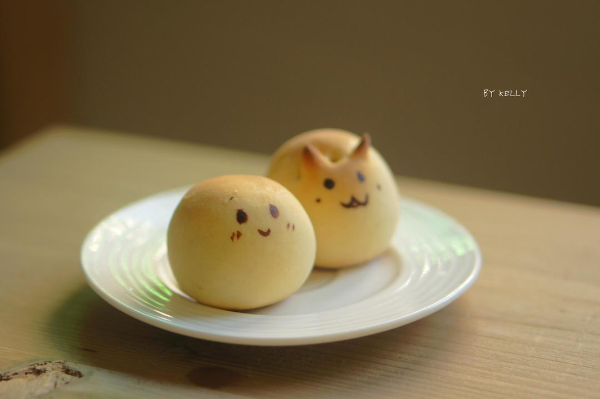

# 减糖好做的烧果子

## 📋 基本資訊 / Recipe Overview
- **料理名稱**：减糖好做的烧果子
- **原始標題**：减糖好做的烧果子
- **素食流派 / Diet**：蛋奶素 Ovo-Lacto
- **料理分類 / Category**：面食主食
- **來源平台 / Source**：[下廚房 · 素食主義專區](https://www.xiachufang.com/recipe/100104591/)

## 🌿 食材及佐料清單 / Ingredients
- #果子皮材料#
- 110g低粉
- 60g炼乳
- 20g椰奶（或淡奶油）
- 1/4小勺（2.5g）泡打粉
- 1个蛋黄
- #内陷#
- 15*7g馅料

## 🍳 烹飪步驟 / Step-by-Step Cooking Steps
1. 超级简单的做法呢~
2. 1.湿性材料搅拌均匀
3. 2.筛入混合粉类。
4. 3.切拌均匀
5. 4.扔冰箱冷藏半小时。
6. 5.取出分割成20g小块 案板上撒粉 不过因为炼奶量减少的原因 不会粘手噢O(∩_∩)O
7. 6.擀圆包馅。
8. 7.可以滚圆也可以剪成经典的兔子喔
9. 8.用毛笔蘸黑色素画上笑容~
10. 9.160度 烤至表面金黄噢。

## 💡 大廚美味秘訣 / Chef's Tips
- 话说因为实在太萌啦~ 阿猪说话都嗲了起来(⊙o⊙)… 
 试一下呐 很好吃的(╯3╰)

---
*食譜歸檔時間：2026-08-20 · 來源：下廚房 (www.xiachufang.com)*