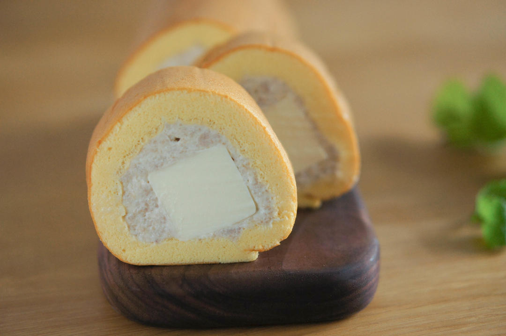

# 几分甜香芋奶冻卷 卷不裂配方+新鲜香芋奶油+入口即化奶冻 烘焙视频蛋糕篇7「薄卷」

## 📋 基本資訊 / Recipe Overview
- **料理名稱**：几分甜香芋奶冻卷 卷不裂配方+新鲜香芋奶油+入口即化奶冻 烘焙视频蛋糕篇7「薄卷」
- **原始標題**：几分甜香芋奶冻卷/卷不裂配方+新鲜香芋奶油+入口即化奶冻/烘焙视频蛋糕篇7「薄卷」
- **素食流派 / Diet**：蛋奶素 Ovo-Lacto
- **料理分類 / Category**：面食主食
- **來源平台 / Source**：[下廚房 · 素食主義專區](https://www.xiachufang.com/recipe/102334416/)

## 🌿 食材及佐料清單 / Ingredients
- #（28*28不沾烤盘）蛋糕卷配方#
- 4个鸡蛋
- 40克植物油
- 50克细砂糖
- 50克牛奶
- 50克低筋面粉
- 几滴香草精
- 五面奶糖四油蛋_(:зゝ∠)_）（简称：
- #（3*3*3cm正方体7块）奶冻#
- 100克淡奶油
- 100克牛奶
- 2.5片（12.5克）吉利丁片
- 18克细砂糖
- #香芋奶油#
- 200克生芋头
- 200克淡奶油
- 40克细砂糖

## 🍳 烹飪步驟 / Step-by-Step Cooking Steps
1. 烤箱预热至180℃。
烤盘涂油铺纸，用刮刀推去气泡。
2. 倒入牛奶
3. 植物油
4. 香草精。
5. 筛入面粉。
6. 搅拌成糊。
7. 加入蛋黄，搅拌均匀。
8. 打发蛋白，分两次下糖。
9. 打发到膨胀发白后下一半糖。
10. 打发到泡沫细腻，但提起打蛋器会滑落时下剩余的糖。
11. 打发到纹路清晰，提起打蛋器会呈现小弯钩，轻轻晃动盆子，蛋白霜会轻微移动即可。
12. 倒一勺蛋白霜和蛋黄糊拌匀。
13. 倒回蛋白霜中。
14. 一边转动一边捞拌均匀。
15. 最后用刮刀紧贴底部整理面糊。
16. 高处入模消去大气泡。
17. 向四角倾斜，使面糊均匀分布。
18. 注意：蛋白霜不要打太硬，否则无法自然流平。
19. 震模，消去气泡同时使面糊分布均匀。
20. 180℃，中层，烘焙17分钟后转2分钟热风。
如无热风功能，烘焙20分钟直至表面金黄色。
21. 出炉后震出热气，正面朝上晾凉。
22. 接下来制作奶冻。
（个人建议提早一天制作，冻硬了好脱模）
配方可制作3*3*3cm正方体7块，恰好用完无剩余。
吉利丁片先用冰水泡软。
23. 奶锅中倒入牛奶。
24. 开火。
25. 倒入砂糖。
26. 不断搅拌，直到砂糖溶解，奶锅边缘出现气泡。
27. 关火，加入泡软的吉利丁片。
搅拌均匀。
28. 倒入淡奶油，搅拌均匀。
29. 做出正正方方棱角分明的奶冻，不需要特制的模具，只需要你家的冰格b(￣▽￣)d
有硅胶的当然好，没有的话也不要紧，用水冲一下，之前冰块怎么出来的这货也会顺顺利利溜出来哒~
妈妈再也不用担心我的奶冻变成s形啦~\(≧▽≦)/~
30. 倒入冰格。
31. 放入冰箱冷冻。
注意是冷冻不是冷藏~

注意：
1.关火后加入吉利丁片（不然会烧焦）
2.如果没有冰格，可以直接把液体倒入保鲜袋，冷藏凝固后取出切碎使用。
32. 接下来给蛋糕脱模。
用抹刀紧贴烤盘四壁一滑到底。
33. 盖上硅油纸（前后各长15-20cm方便后期整理蛋糕）
34. 倒盖晾网。
35. 翻转倒扣。
36. 脱模。
37. 撕掉油纸。
38. 接下来制作香芋奶油。
39. 如果按通常的方法蒸熟/煮熟，会有多余水分，但是普通的搅拌机打不动，还得下牛奶，然后就得到了一盆浆糊，于是咱们还得开锅炒干芋泥（听起来有点累觉不爱_(:зゝ∠)_）

如果分量不是很大，不妨尝试一下这种方法，将芋头切丁，盖上盖子，微波3-4分钟，直到筷子可以轻易插入，取出，趁热过筛。
个人感觉这样的芋头香气会更足，同时也没有太多水分。
要趁热过筛，晾凉就硬了。
40. 过筛的方法依旧是一物多用，使用擀面棍一端，用力将芋丁摁过筛网。
41. 不时用刮刀把背面的芋泥刮下来。
我们就得到了一盆干干糯糯的芋泥。
42. 接下来打发奶油。
淡奶油加入细砂糖。
43. 打发至奶油变稠（大约六分发）
44. 加入芋泥。
45. 搅打均匀，不要打太久。
饱含淀粉的芋泥会使奶油变稠，成为不易溶化的香芋奶油。

所以，如果发现芋丁是水水的脆脆的，扔了别用，差劲的芋头做不出好吃的芋泥的。
46. 低速缓提甩掉打蛋头上的香芋奶油。
47. 卷制前再取出奶冻脱模。
48. 铺上硅胶垫防滑，放上蛋糕。
斜切掉前后边缘。
49. 抹一层香芋奶油。
50. 在身侧排列上奶油，注意中间紧贴不要留有空隙。
51. 将剩余的奶油涂在奶冻上。
52. 边缘修圆，成为弧形。
53. 用擀面杖卷起油纸提起蛋糕。
54. 压实定型。
55. 一鼓作气往前卷，直到擀面棍碰到垫子。
56. 之前的「胖乎乎奶油芒果卷」http://www.xiachufang.com/recipe/102311306/
和「榴莲多多奶油卷」http://www.xiachufang.com/recipe/102315004/
都有详细的卷制手法，大同小异，建议没有把握的全部看完再操作，可以提高成功几率。
57. 左手往前拉，右手往后推，拉实蛋糕。
58. 蛋糕卷就做好啦~

## 💡 大廚美味秘訣 / Chef's Tips
- 蛋糕卷注意事项：
1.要想不掉皮，17分钟烤完最后多烤2分钟热风。（一共19分钟）
2.蛋白霜不要打太硬。
奶冻注意事项：
1.关火后再加吉利丁片不然会烧焦
2.倒入冰格冷冻而非冷藏。
3.卷制前再脱模。
香芋奶油注意事项：
1.芋头要好！微波完先吃一口不好吃不要做！ 
我们又不是小天使能化腐朽为神奇_(:зゝ∠)_
2.趁热过筛。
3.看看筛网的目数，不要用筛糖粉的糖粉筛（否则··· 接受我的祝福）

下期视频是依旧是几分甜的招牌提拉米苏奶冻卷，再见啦~

---
*食譜歸檔時間：2026-08-20 · 來源：下廚房 (www.xiachufang.com)*