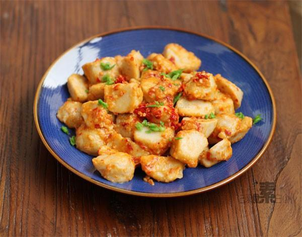

# 剁椒芋头

## 📋 基本資訊 / Recipe Overview
- **料理名稱**：剁椒芋头
- **原始標題**：剁椒芋头
- **素食流派 / Diet**：全素 Vegan
- **料理分類 / Category**：家常蔬食 / 经典热菜
- **來源平台 / Source**：[下廚房 · 素食主義專區](https://www.xiachufang.com/recipe/1004421/)

## 🌿 食材及佐料清單 / Ingredients
- 芋头
- 1大匙剁椒
- 2小匙生抽

## 🍳 烹飪步驟 / Step-by-Step Cooking Steps
1. 芋头洗净表面，带皮放入锅中蒸熟
2. 蒸好的芋头待凉，剥掉皮，切成滚刀块
3. 锅烧热下少许油，下剁椒酱炒香，下入芋头一同翻炒
4. 加生抽和水小火加热入味即可
5. 装盘后撒少许香芹碎点缀
6. 剁椒酱的做法：1.朝天椒洗干净，去蒂，晾干表面水分，用刀剁碎 2.加入适量盐拌匀静置一会，装入无水无油干净瓶中，淋上高度白酒，密封发酵两周即可

## 💡 大廚美味秘訣 / Chef's Tips
- 我用的剁椒酱是已经放了盐的，所以没再加盐，根据情况调整 
 生芋头的粘液沾到手上会发痒，所以干脆蒸熟了在去皮~

---
*食譜歸檔時間：2026-08-20 · 來源：下廚房 (www.xiachufang.com)*